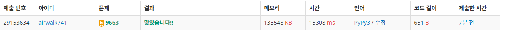

# 5월 10일

#### 1. 색종이 만들기

- 4등분으로 나눌때 2진탐색방법을 이용하여 4사분면처럼 나누기

- mid 부분을 잘 못생각해서 헤맸었다

- 에초에 아이디어가 없어서 스터디원이 푼거 봤는데 좀 더 생각 해볼 걸...

- mid 부분은 그냥 `end//2` 로 계산해서 깊이가 무한정으로 되었었다. 

#### 2. N-Qeen

N-Queen 문제는 크기가 N × N인 체스판 위에 퀸 N개를 서로 공격할 수 없게 놓는 문제이다.

N이 주어졌을 때, 퀸을 놓는 방법의 수를 구하는 프로그램을 작성하시오.

- 이거는 A형 특강때 이미 풀이들 들어서 그런지 쉽게 풀 수 있었다.
- 학기 초에 처음 접했을 때는 이걸 어떻게 풀지..? 이런 생각을 했었는데 재귀를 이용하니 쉽게 풀렸다.
- 아마 저번 숙제였던 순열-조합에서 재귀를 조금 연습해서 이번에 쉽게 풀지 않았나 생각이 든다.

