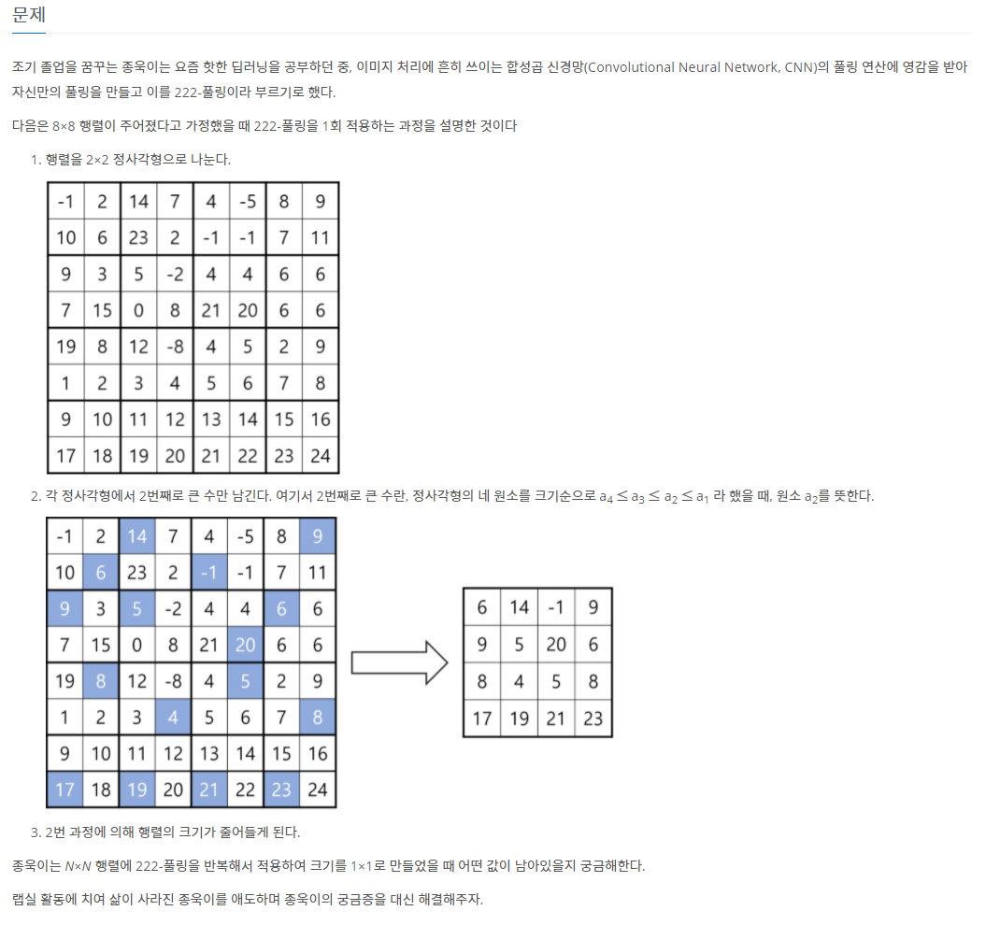

# 5월 12일

### 222-폴링

- 문제를 처음 접했을 때 `2 x 2 `행렬 하나하나에서 찾으면 시간초과가 발생할 것 같아 다른 방법을 생각해봤었다
- 10분 지나고 다른 방법들은 안될것 같았고 이것보다 쉽게 짤 수 없을 것 같아 일단 구현해보았다.
- 그랬는데 이게 왠걸 `python`에서도 통과가 됐다
- 일단 한번 구현해보는게 좋은 것인가...