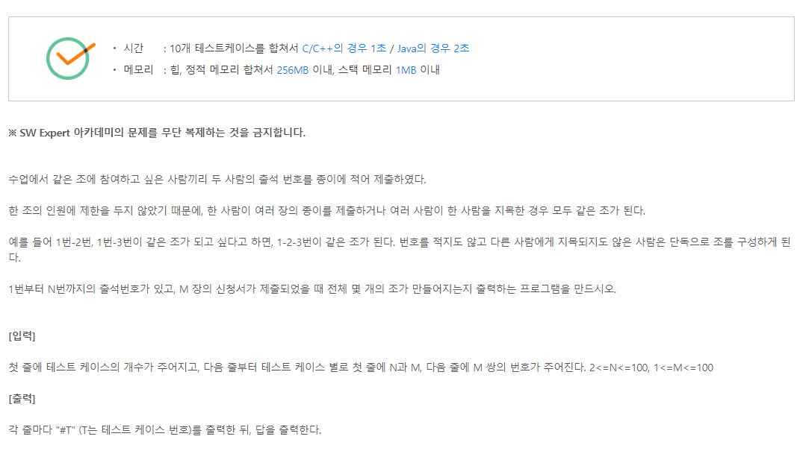

# 5월 15일

#### 5248. [파이썬 S/W 문제해결 구현] 6일차 - 그룹 나누기 

- 어제 트리를 풀면서 무리찾기 어떻게 풀더라...? 라는 생각을 하다가 복습겸 다시 풀어보았다.

- 다행이 풀이는 기억이 나지만 역시나 수업때처럼 꼭 이방법을 써야 하나.. 라는 생각을 했다.

- 하지만.... 내가 생각한 풀이로 풀게 된다면 코드 라인이 저번처럼 엄청 길어진다.

- 이 방법이 나중에 많이 쓰일 수도 있으니 까먹지 말고 기억 해 두어야겠다.

  

