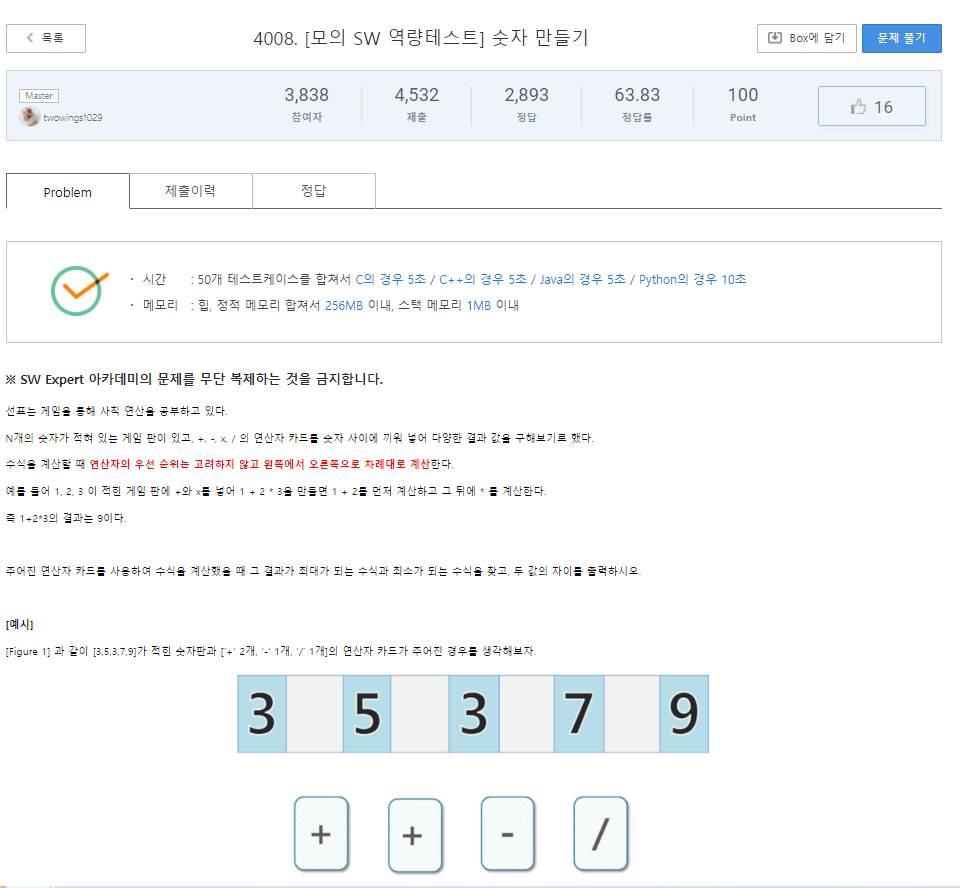
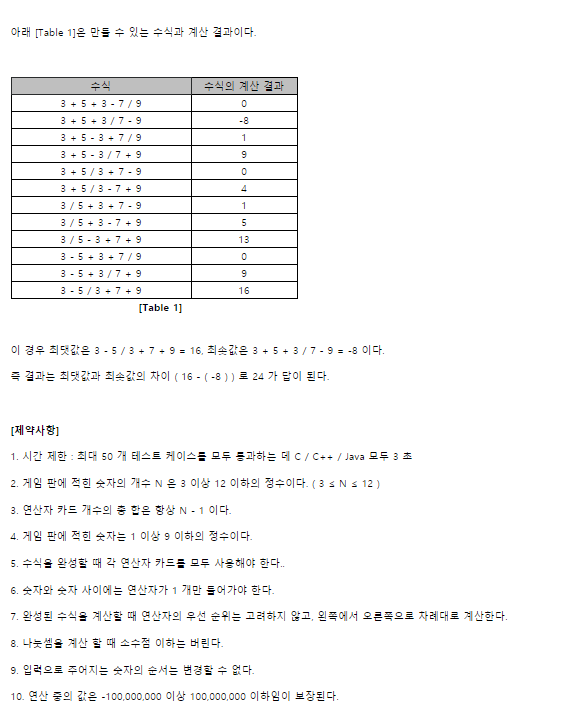

# 5월 18일

#### 4008. [모의 SW 역량테스트] 숫자 만들기

### 풀이

- 처음 풀었을 때는 순열로 연산자가 나열될 수 있는 경우를 구하고 그것을 하나씩 `pop()`을 통해 계산하게 구현했다.
- 풀기 전에 "아... 이거 시간초과 발생 할 것 같은데..."라는 생각을 했는데 아니라 다를까 시간초과가 났다.

- 코드를 버리고 싶지 않아 좀 더 수정해도 시간 초과 나길래 다른 방법을 생각했다.
- 순열이라면 중복이 없을텐데 중복이 있다고 처음에 생각을 해서 아.. 이거 아닌데? 라는 생각으로 다시 작성했다.
- 두번째는 따로 배열을 저장하지 않고 아예 재귀를 돌때 인자로써 계산값을 보내줬다.
- 이랬더니 `pop()` , `append()`가 없어서 그런가 시간이 적게 걸렸다.

