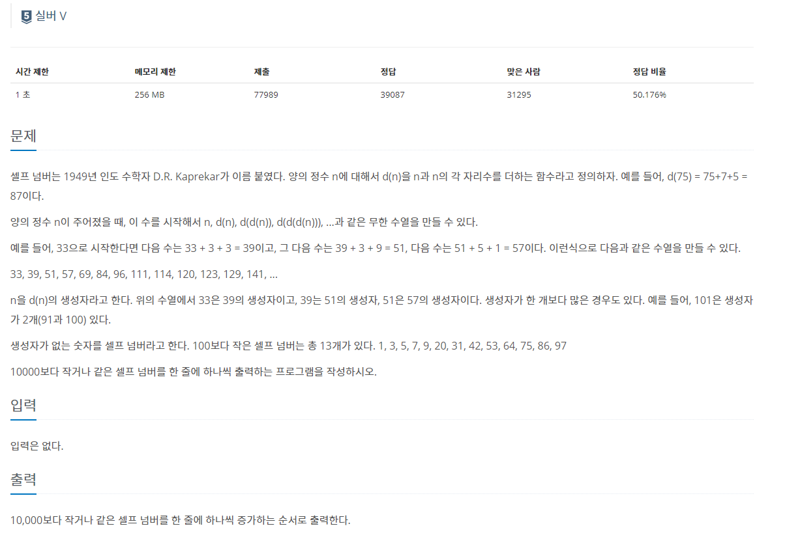
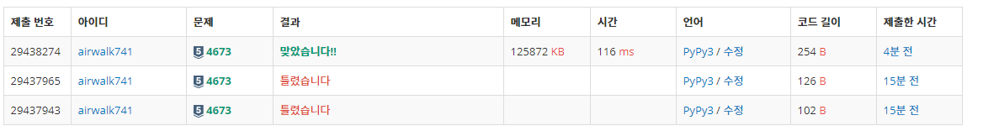

# 5월 20일

## 셀프 넘버

- 오늘부터 프로젝트하는 날이라서 스터디 당분간 진행하지 않는다
- 그래도 알고리즘 한문제 정도는 가볍게 풀고 싶어 레벨에 맞춰 풀었다.
- 문제 고르는 요령
  - 자신에게 맞는 레벨 풀기
  - 사람들이 많이 푼 알고리즘 풀기
    - 풀지 못했을 때 구글링으로 답을 알 수 있어 공부할 수 있음

- 이 문제는 SWEA에서 본거 같은데 찾아볼려니 안나왔다
- 아마 문제만 보고 지나쳐서 그런가...?
- 아무튼 그래도 풀었던 코드가 기억나지 않아 다시 풀었는데... 좀 시간이 걸렸다
- `set()`이라는 함수에 대해서 다시 알아가는 좋은 문제라고 생각이 든다.

