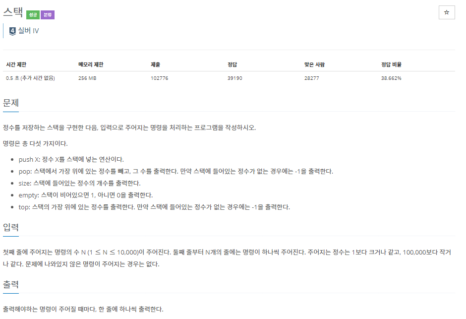
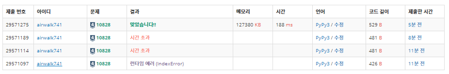

# 5월 25일

- 첫 번째 FAIL
  - 빈 값에서 `pop()`를 하게 되었을 때 에러처리를 해주지 않았다.
  - 빈 값에서 `top()`를 했을 때 에러 처리를 해주지 않았다.

- 두 번째 FAIL

  - `input()`으로 입력을 받으면 시간초과 
  - 이를 해결하기 위해 `sys.stdin.readline()`을 사용
  - 하지만 `sys.stdin.readline()`는 개행까지 배열에 담게 된다.
  - 그래서 `strip()`을 사용해서 공백을 제거하고 배열에 담에 사용했다.

  

