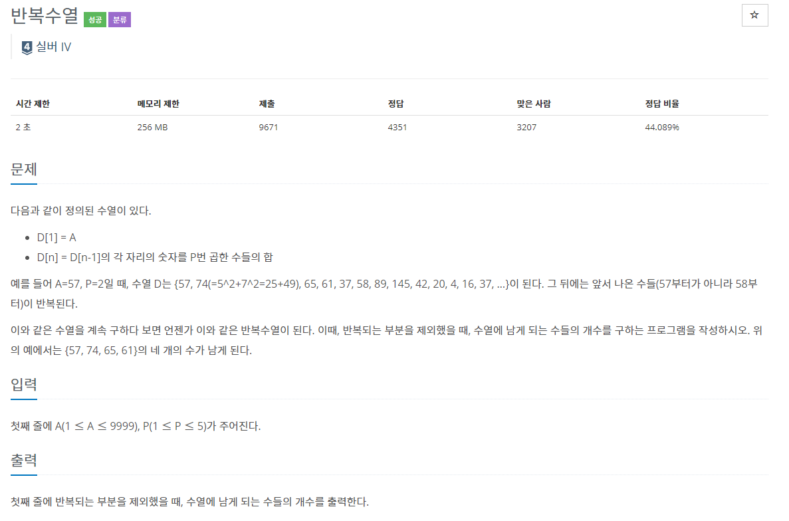
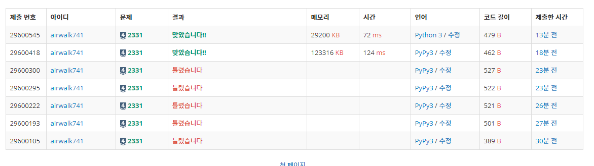

# 5월 26일

[](https://www.acmicpc.net/problem/2331)


- 처음에 풀때는 어거지로 풀다가 반례를 `질문검색`에서 찾고 그것을 해결하려고 한줄한줄 바꿔가며 코드를 구현했다
- 당연히 코드도 엉망이고 내가 하고자 했던 코드 구현이 되지 않아 코드를 싹 갈아 엎었다.
- 다시 생각해보니 너무 쉬웠던 문제였고 다른 사람 풀이를 보았다.
- 다른사람은 `index()` 함수를 사용했는데 접근 방법은 나랑 같지만 나보다 더 쉽게 푼 셈이다


```python

num, p = input().split()
result = [int(num)]

while True:

    number = 0

    for i in range(len(num)):
        number += int(num[i]) ** int(p)

    if number not in result:
        result.append(number)
    else:
        print(result.index(number))
        break
```


- `result`에 있는 숫자가 나왔다면 그 다음부터 반복이 됨으로 여기서 바로 `break`하고 인덱스 값을 구하면 쉽게 나온다.


