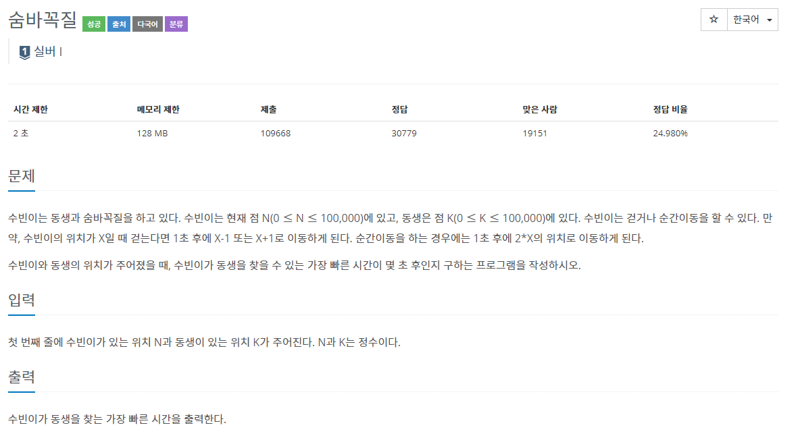
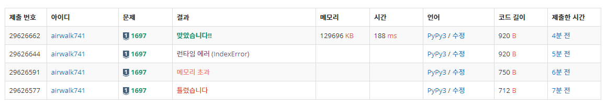

# 5월 27일

## 1. 촌수계산

- 트리를 이용해서 푼 문제
- 부모 자식 관계를 통해서 트리라는 2차원 배열을 만든다.
- 현재 위치인 나는 자식을과 연결되어 있고 부모와 연결되어 있음을 캐치 후 문제를 풀었다.
- 백준의 `토마토` 문제처럼 다음 q 길이를 체크해 `cnt`를 증가시켜 값을 구했다.

#### fail 했던 이유

- 친척끼리 연결 되지 않을 수 있는데 이 경우를 체크하지 않았다.
- 출력 결과 예시를 꼭 읽고 풀어보도록 하자

## 2. 숨바꼭질

- 스터디 처음 시작했을 때 풀었던 문제와 유사
- 그때는 골드 문제였는데 순간이동하면 시간초가 지나지 않는 조건때문에 힘들었던 기억이 있음
- 촌수계산과 마찬가지로 길이만큼 q를 돌려 문제를 해결하였다

### fail 이유

- 수빈이와 동생이 같은 위치에서 시작할 수도 있다는 것을 고려하지 않았다.
- 방문체크를 하기 위해 `visited` 변수를 선언했는데 사용하지 않아 메모리 초과가 발생했다.
- 인덱스는 0부터 시작하기 때문에 +1을 해줘야하는데 그러지 않았다.

