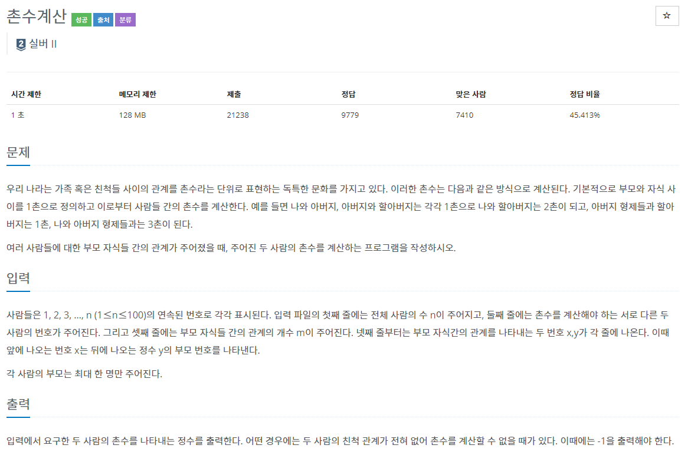
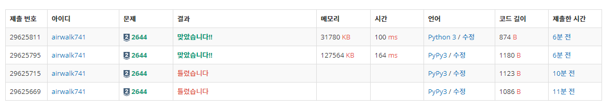

# 5월 27일

- 트리를 이용해서 푼 문제
- 부모 자식 관계를 통해서 트리라는 2차원 배열을 만든다.
- 현재 위치인 나는 자식을과 연결되어 있고 부모와 연결되어 있음을 캐치 후 문제를 풀었다.
- 백준의 `토마토` 문제처럼 다음 q 길이를 체크해 `cnt`를 증가시켜 값을 구했다.

#### fail 했던 이유

- 친척끼리 연결 되지 않을 수 있는데 이 경우를 체크하지 않았다.
- 출력 결과 예시를 꼭 읽고 풀어보도록 하자

