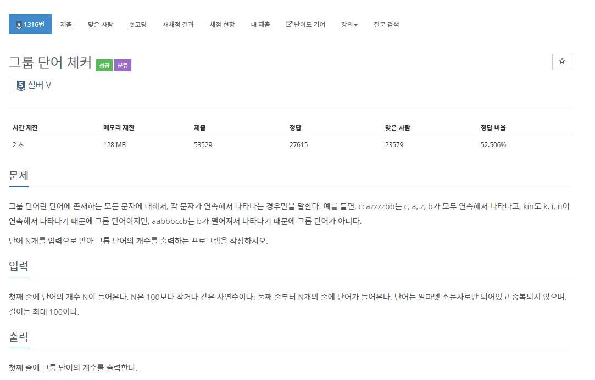

# 5월 29일




- 간단한 문제 

- 하지만 다른 풀이가 정말 신기했던 문제
- `sorted()` 공부해서 잘 활용해보자 좋은 것 같다.


```python
result = 0
for i in range(int(input())):
    word = input()
    if list(word) == sorted(word, key=word.index):
        result += 1
print(result)
```

