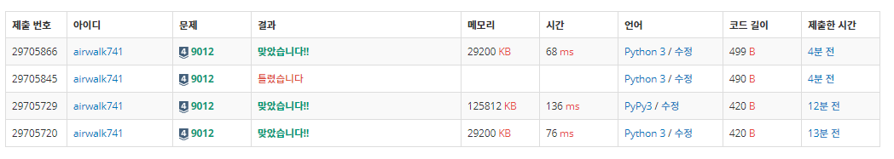

# 5월 31일

[](https://www.acmicpc.net/problem/9012)


- 확실히 `try` `except` 구문을 알아두니 이런 문제는 편하게 풀 수 있는 것같다.
- 물론 `실버4` 문제이긴 하지만 내가 지금 실버4
- 다른 사람의 풀이를 봤는데 ' 와 이렇게 생각하면 진짜 더 쉽고 빠르게 체크할 수 있구나' 라는 생각했다.
- 나는 `pop()` 과 `append()`를 사용해서 조금 느린감이 있다.

- 또한 `input = sys.stdin.readline` 이용하면 맨끝에 테케가 여러 개라고 했을 때 끝에 빈 공백이 들어감에 유의하자 

  - `text = list(input().rstrip())` 스트립 써야함

  

```python
from sys import stdin

n = int(input())
for _ in range(n):
    str_ = stdin.readline().strip()
    stack = 0
    for chr_ in str_:
        if chr_ == '(':
            stack += 1
        else:
            stack -= 1
            if stack < 0:
                break
    if stack == 0:
        print('YES')
    else:
        print('NO')
```


