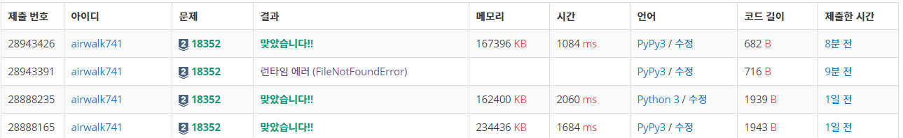

# 5월 1일

#### 특정 거리의 도시 찾기

- 처음 풀 때는 딕셔너리만 생각했는데 계속 생각해보니 괜히 그렇게 하면 타입변환을 계속 해야하기 때문에 시간이 더 걸리지 않을까? 라는 생각을 했다.
- 그래서 리스트로 한번 해봐야지 했다가 스터디원이 리스트를 한 것이 있었다.

```python
from collections import deque
import sys
sys.stdin = open('input.txt', 'r')

def bfs(n):
    q = deque()
    q.append((n, 0))
    visited[n] = 1
    while q:
        x, cnt = q.popleft()
        if cnt == K:
            res.append(x)
        elif cnt < K:
            for city in load[x]:
                if visited[city] == 0:
                    visited[city] = 1
                    q.append((city, cnt+1))


N, M, K, X = map(int, sys.stdin.readline().split())
load = [[] for _ in range(N+1)]
visited = [0 for _ in range(N+1)]
res = []

for i in range(M):
    a, b = map(int, sys.stdin.readline().split())
    load[a].append(b)

bfs(X)
if res:
    res.sort()
    for i in res:
        print(i)
else:
    print(-1)
```

- 확실히 딕셔너리를 이용한 것보다 시간이 적게 걸렸다.

