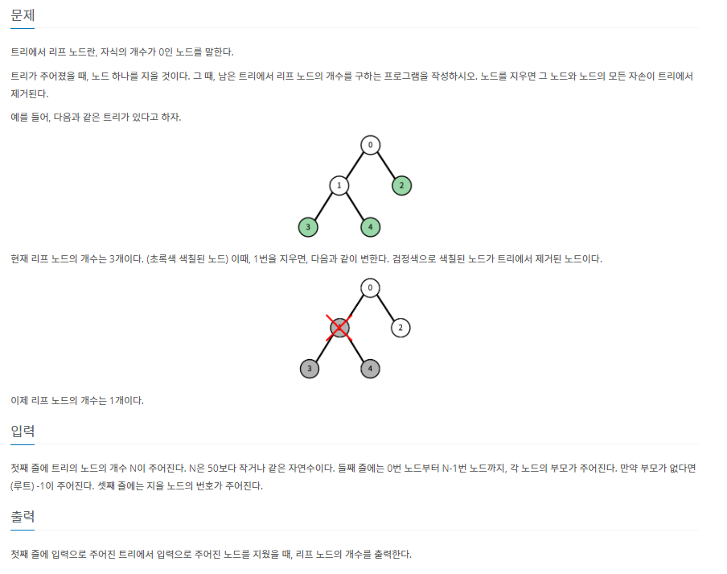

# 5월 5일

#### 1. 트리




- 문제의 설명이 약간 부족한 것 같다.
  - 그림과 예제는 이진트리처럼 예시를 주었지만 이진 트리가 아니다
  - 루트가 하나만 있다고 하지 않았다 => 트리가 여러개 존재 할 수 있다.
  - 루트는 항상 0 또는 1이 아니다.
- 위의 3조건이 명확하지 않아서 처음 풀때 많이 헷갈렸었다.


### 풀이

```python
import sys
sys.stdin = open('input (43).txt', 'r')
input = sys.stdin.readline

# 노드 삭제하기
def inorder(idx):

    # 자식 없으면 pass
    if len(tree[idx]) != 0:

        # 왼쪽 노드부터 계속 빼낸다는 느낌
        while tree[idx]:
            inorder(tree[idx][0])
            tree[idx].pop(0)

# 단말 노드 찾기
def search(idx):
    global cnt

    if len(tree[idx]) == 0:
        cnt += 1
    else:
        for i in range(len(tree[idx])):
            search(tree[idx][i])


n = int(input())

arr = list(map(int, input().split()))

check = int(input())

tree = [[] for _ in range(n)] # 트리가 이진 트리가 아니다
roots = [] # 트리가 여러개일 수도 있다 ( 루트가 여러개)

for i in range(n):
    # -1이면 root 배열에 넣고 아니면 tree에 넣기
    if arr[i] == -1:
        roots.append(i)
    else:
        tree[arr[i]].append(i)

# print(tree)
inorder(check)

# check인거 찾기
for i in range(n):
    if check in tree[i]:
        tree[i].remove(check)
        break

# 결과값
cnt = 0

# 루트 노드들 하나씩 꺼내서 찾기( = 트리 하나씩 꺼내서 찾기 )
for root in roots:

    if tree[root]:
        search(root)

    else:
        if check != root: # 제거할 노드가 루트 노드였다면 루트도 단말 노드가 될 수 있으므로 +1
            cnt += 1

print(cnt)
```


[](https://www.acmicpc.net/problem/1068)

