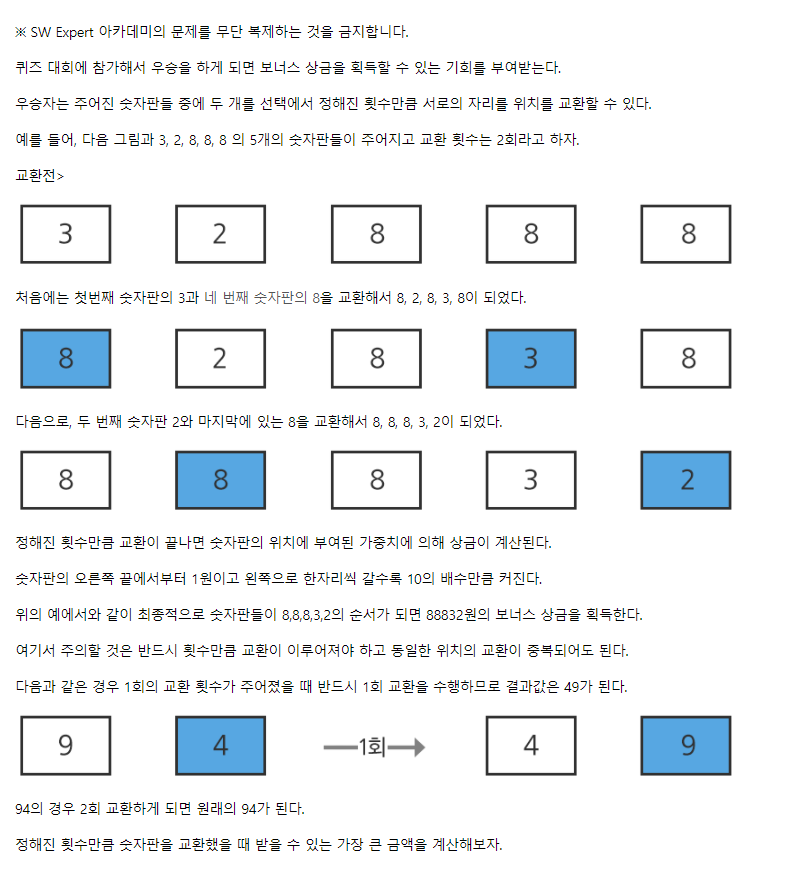

# 5월 6일

#### 1 .최대상금




- 2월에 이 문제를 처음 맞이했을때는 `DFS`개념을 알지 못해서 TEST-CASE 마다 조건을 주어 풀고자 하였다.
- 당연히 해결하지 못했는데 `DFS`를 배우고 난후에는 쉽게 해결할 수 있었다

- 확실히 알고리즘 실력이 조금 향상된거 같다.


- 처음 풀고자했을 때 코드

```python
number = int(input())

for j in range(1, number+1):


    nums, count = list(map(list, input().split()))

    if len(count) == 2:
        count = int(count[0]) * 10 + int(count[1])
    else:
        count = int(count[0])

    # a_list는 나중에 결과로 출력 할 것임
    a_list = []
    # re_count는 나중에 count가 변화가 있는지 없는지 볼려고 만든 변수
    re_count = count
    b = 0
    while count > 0:
        a = 0
        # nums가 비어 있고 
        if bool(nums) == False :
            # 바꿀 수 있는 횟수가 홀수개이고
            if count % 2:
                # 남은 count와 처음 count(re_count)가 다르다면
                if re_count != count:
                    # 맨 뒤에 두 자리 수를 바꾼다. (그래야 최대상금)
                    a_list[len(a_list)-2], a_list[len(a_list)-1] = a_list[len(a_list)-1], a_list[len(a_list)-2]
                break
            else: # 그게 아니면 그냥 while문 빠져나온다.
                break
        # 최댓값의 인덱스 찾아서 a_list에 추가하기 위해서
        idx = 0
        # 값을 비교하기 위해 result 변수 사용
        result = nums[0]
        # num 리스트 길이만큼 반복한다.
        for i in range(len(nums)):
            # 만약 reulst 값보다 큰 값이 나온다면 result 값을 변경하고 idx 값도 저장한다.
            if result <= nums[i]:
                result = nums[i]
                idx = i
                
        # a에다가 최댓값을 저장한다.
        a = nums[idx]
        # 만약 숫자의 최고자리 숫자와 찾은 최댓값이 다르다면
        if nums[0] != nums[idx]:
            # 두 개를 스왑한다.
            nums[0], nums[idx] = nums[idx], nums[0]
            count -= 1 # 스왑했으니까 count 감소
            if a == b and count == 0:   # 만약 b의 값과 a의 값이 같고 바꿀 횟수가 없다면 (#5번 때문에 이렇게 함)
                nums[idx], nums[idx+1] = nums[idx+1], nums[idx] # 최댓값 찾은것과 그 보다 바로 낮은 자리수의 숫자을 스왑

        a_list.append(nums[0]) # a_list에 최고자릿수의 숫자를 넣는다
        b = a_list[0] # 바꿨던 수(찾은 최댓값)가 다음에 찾은 최댓값(a)와 같은지 비교하기 위해서 선언했음
        nums.remove(nums[0]) # nums의 첫번째를 a_list에 저장했기 떄문에 삭제한다.

    a_list += nums # while문을 나갔다는 것은 더이상 교환 할 횟수가 없다는 뜻이므로 나머지를 a_list에 더해준다.
    re_result = 0 # a_list는 리스트 이기때문에 숫자로 바꿔주기 위해서 변수 하나 만들었다.
    for i in range(0, len(a_list)): 
        re_result += int(a_list[len(a_list)-1-i]) * (10**i) # 숫자로 표현하기 위한 for문
 
    print(f'#{j} {re_result}') # 출력
```


[](https://swexpertacademy.com/main/code/problem/problemDetail.do?contestProbId=AV15Khn6AN0CFAYD)

