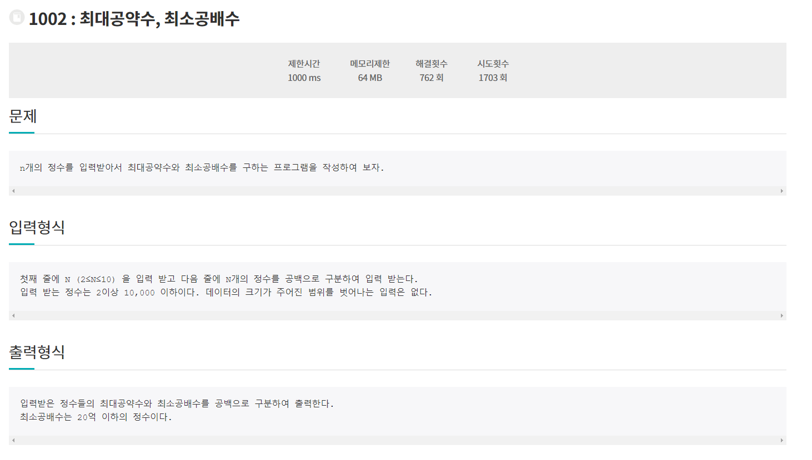
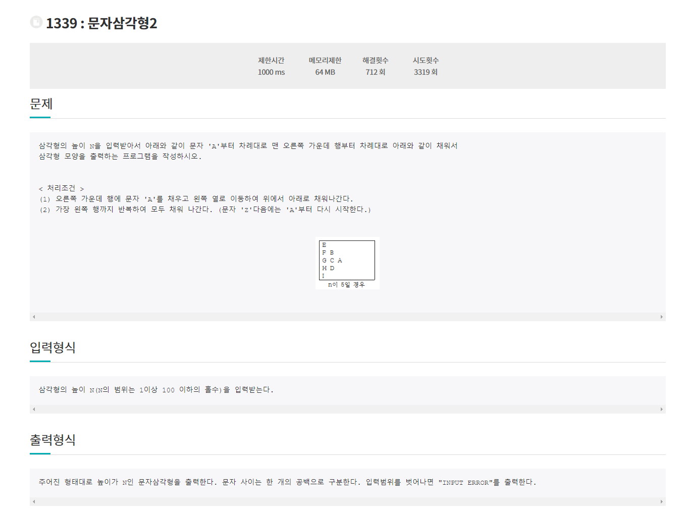

# 6월 10일

> Jungol  Beginner_Coder 풀이

## 🚩 헷갈린 문제

)

#### ✍ 풀이

- 큰 수부터 나눠서 약수를 구하게 되면 2개 이상의 수에서 최소공배수가 꼬이게 된다.
- 소수로만 나누는데 가장 작은 것으로만 나눠서 구했다.

- 최대 공약수는 학창시절 많이 풀어서 알지만 최소 공배수가 많이 헷갈린 문제였다.

## 🚩 해결 못한 문제

)

#### 😒 fail

- 예시는 맞다
- 정올은 테케가 틀리면 왜 틀린지 보여주는데 이거는 왜 틀린지 보여주지 않았다.
- 다른 히든테케가 없는거같은데 이상하게 PASS가 안된다.