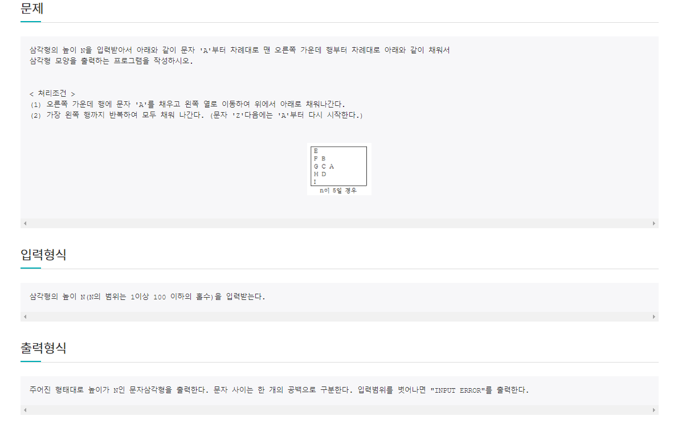
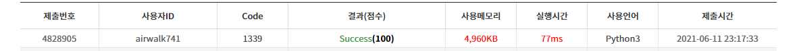

# 6월 11

# 🚩

[]((http://jungol.co.kr/bbs/board.php?bo_table=pbank&wr_id=914&sca=2020)
)


#### ✍ 풀이

- 도형만들기2는 헷갈리는 문제들이 많은 것 같다.
- 나중에 다시 풀어볼 필요가 있다.
- 이 문제는 `*` 문제와 달리 배열로 만들어서 해결했다.


# 🚩

[](http://jungol.co.kr/bbs/board.php?bo_table=pbank&wr_id=2075&sca=2010)


#### 😒 fail 이유

- 어제 못 풀었던 문제
- 계속 맞는 줄 알았는데 알고보니 n 값의 범위가 있었음
- 문제 풀기전에 꼼꼼히 읽어보자


```python
n = int(input())

arr = [[0] * n for _ in range(n)]
k = 0
p = 0
if -1 < n < 101:
    if n % 2:
        for j in range(n//2, -1, -1):
            p += 1
            for i in range(n // 2 - p + 1, n // 2 + p):
                    k = k % 26
                    arr[i][j] = chr(k + 65)
                    k += 1

        else:
            for i in range(n):
                for j in range(n):
                    if arr[i][j]:
                        print(arr[i][j], end=' ')
                print()
    else:
        print('INPUT ERROR')
else:
    print('INPUT ERROR')
```


