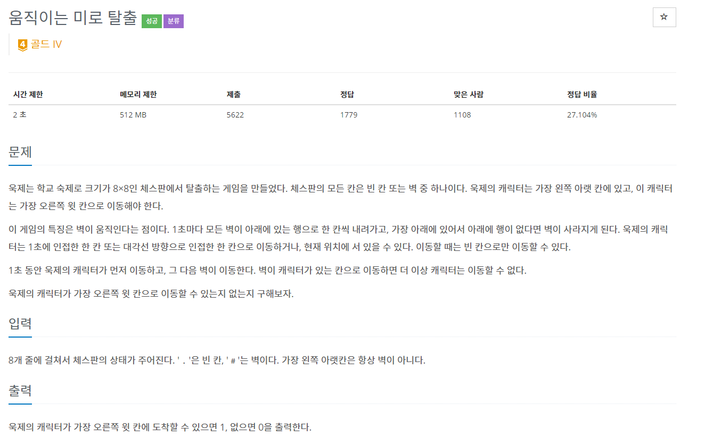
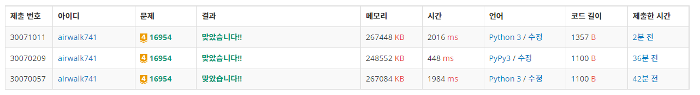
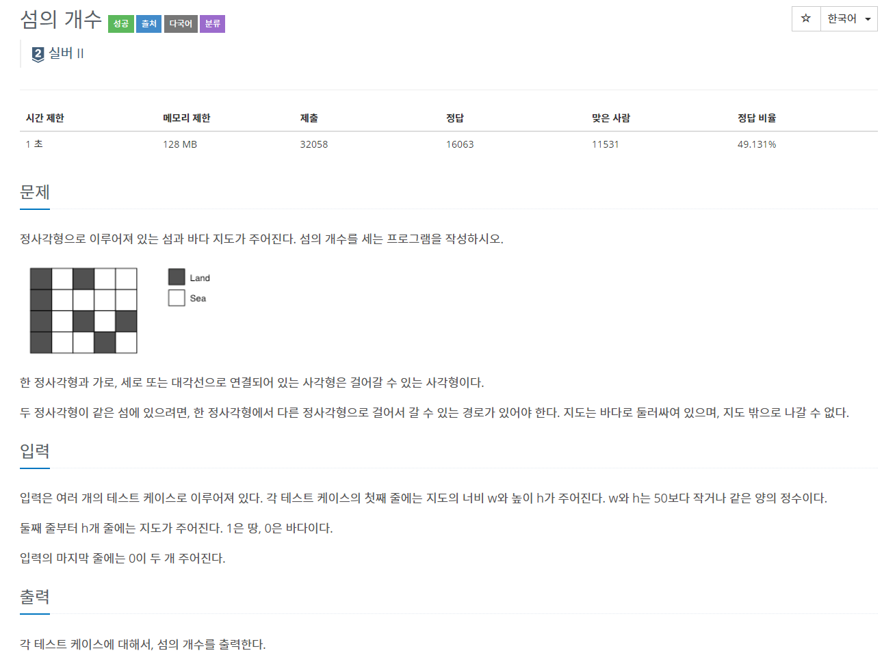
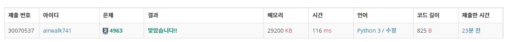

# 6월 15일

## 🚩

#### ✍ 풀이

- 체스판을 오른쪽으로 돌린다.
- 현재 지점에서 이동할 수 있는 곳을 `q`에 넣는다.
- 오른쪽으로 체스판을 돌렸기 때문에 왼쪽을 하나씩 제거하고 오른쪽을 하나씩 추가한다.
  - 그럼 체크판은 바뀌게 되고 `q`에 넣어 두었던 위치는 그대로이다
- `q`를 하나씩 꺼내서 변경된 위치의 체스판이 벽이라면 `0`을 출력한다.
- 모든 벽이 없다면 `1`을 출력한다.

#### 😒 아쉬운점

- `pop(0)`를 많이 써서 시간이 오래 걸렸다.
- 근데 원래 체크판이 8 X 8이라서 사용해봤었다.

## 🚩

#### ✍ 풀이

- `DFS` `BFS` 기본문제
- 땅이 있고 방문 안하면 `DFS` 함수 호출하고 `result` 값 **1** 증가 시키기

