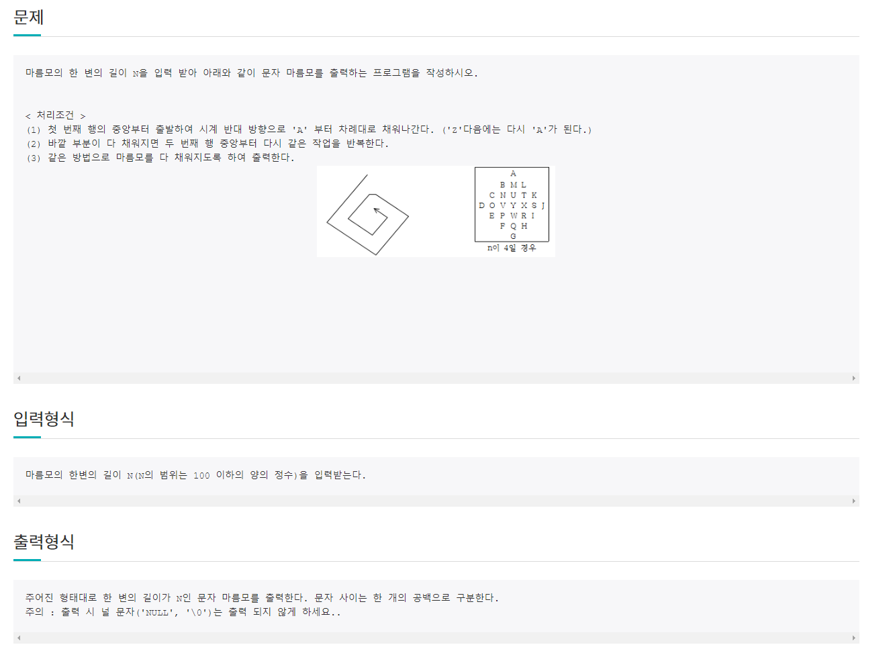
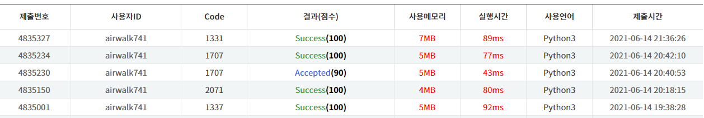

# 6월 15일

# 🚩 

#### ✍ 풀이

- `row` 와 `column` 기준으로 범위를 나누고 벗어나면 `while` 안쪽의 `while`을 `break`
- 각각의 마름모 한변의 길이마다 `while`문을 생성해서 해결해 갔다.

#### 😒 잘 못 생각했던 것

- `row`와 `column` 각각 조건을 주지 않고 `row` 만 하려고 해서 전혀 다른 값이 계속 나왔다.
- `n`을 변경해주지 않아 범위가 이상해졌었다.

