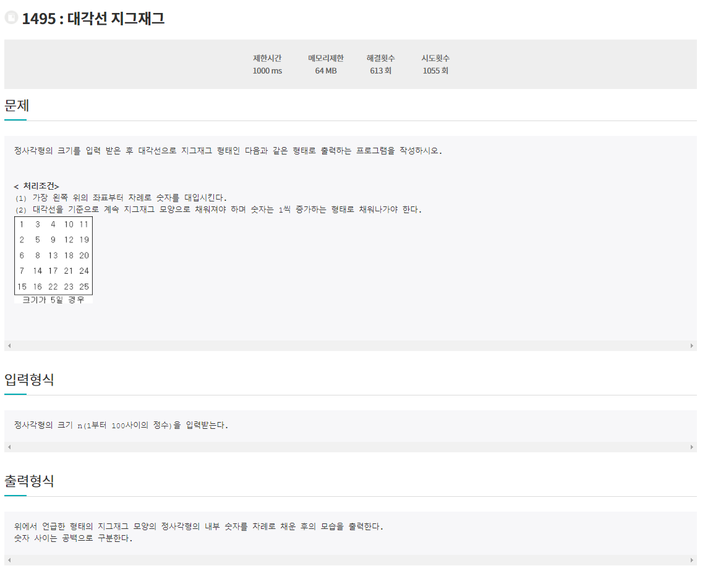
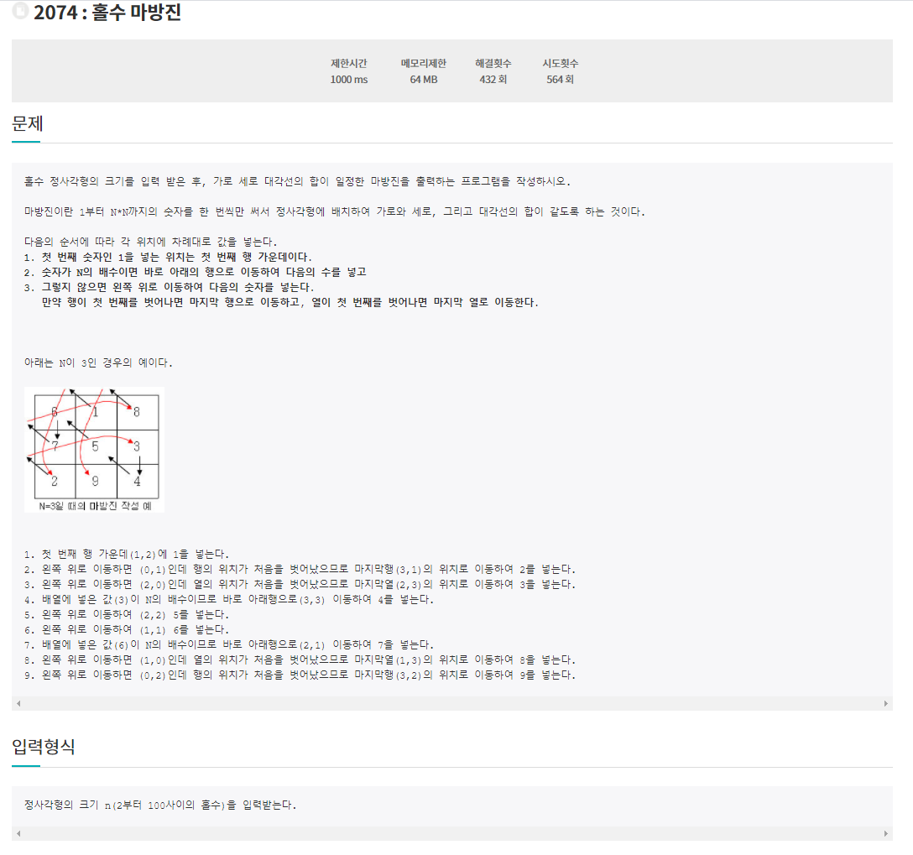
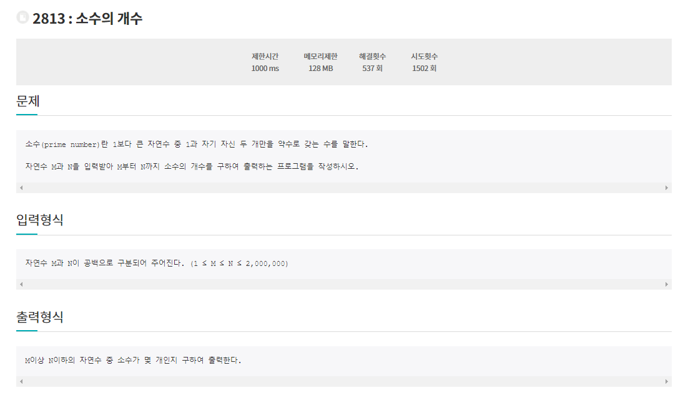
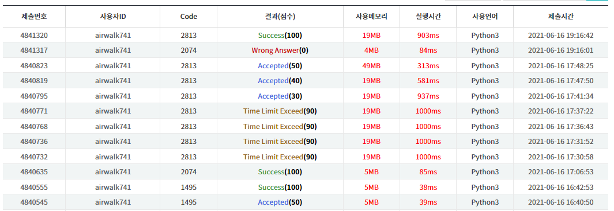
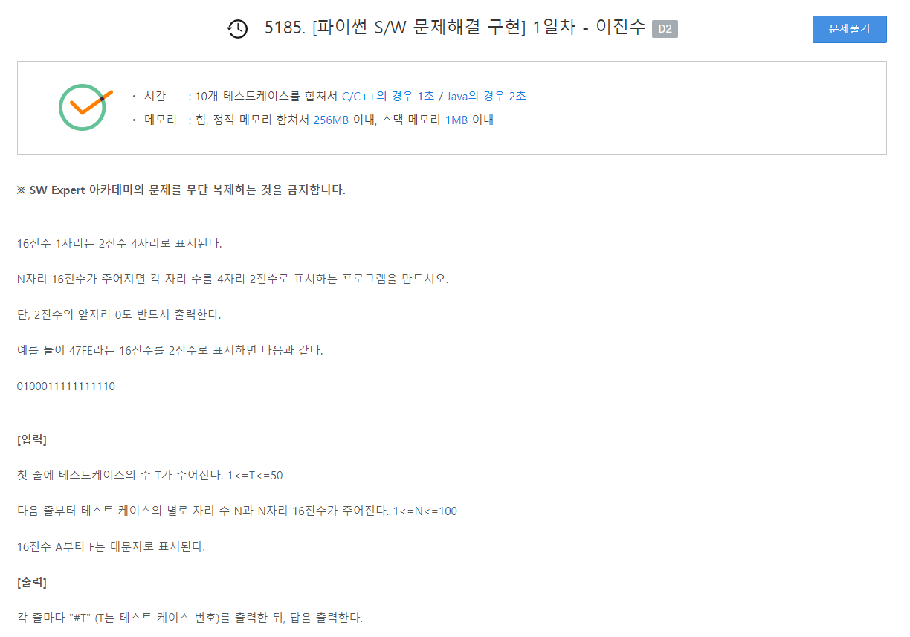
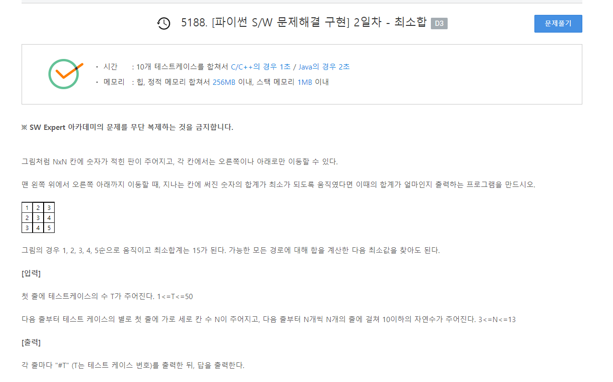

# 6월 6일

## 🚩 

[](http://jungol.co.kr/bbs/board.php?bo_table=pbank&wr_id=767&sca=2020)


#### ✍ 풀이

- 대각선 반 기준으로 위에 부분 아래부분 나눠서 구현
- N이 짝수 일때와 홀수 일때 나눠서 구현


## 🚩

[](http://jungol.co.kr/bbs/board.php?bo_table=pbank&wr_id=1338&sca=2020)


#### ✍ 풀이

- 위에 조건에 맞게 그대로 구현
- 중학교 때 수업시간에 마방진 배웠는데 기억이 났네


## 🚩

[](http://jungol.co.kr/bbs/board.php?bo_table=pbank&wr_id=2079&sca=2040)


#### ✍ 풀이

- 에라토스의 체로 구현


#### 😒 fail 이유

- 에라토스의 체를 잘 못 알고 있었다
- 중복으로 처리하는 경우가 많아져서 시간초과가 발생했다.

```python
for j in range(i * i, m + 1, i):
```




# 복습

## 🚩




#### ✍ 풀이

- 16진수는 `dic`로 정의해서 사용했다.
- 전에 풀었을 때는 `try` `except`를 이용해서 해결했다.
- 비슷하게 풀었다.


## 🚩




#### ✍ 풀이

- 저번엔 재귀를 이용해서 풀었다면 이번엔 `DFS`를 `Stack`을 이용해서 해결했다.
- 뭔가 `Stack`을 이용해서 풀었던 것이 시간복잡도가 작을 것 같다.