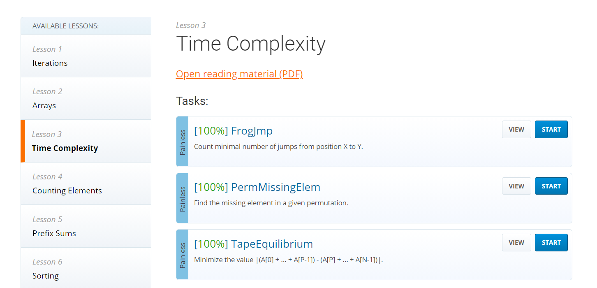

# 6월 18일

## 🚩 Codility


You are given N counters, initially set to 0, and you have two possible operations on them:

> - *increase(X)* − counter X is increased by 1,
> - *max counter* − all counters are set to the maximum value of any counter.

A non-empty array A of M integers is given. This array represents consecutive operations:

> - if A[K] = X, such that 1 ≤ X ≤ N, then operation K is increase(X),
> - if A[K] = N + 1 then operation K is max counter.

For example, given integer N = 5 and array A such that:

```
    A[0] = 3    A[1] = 4    A[2] = 4    A[3] = 6    A[4] = 1    A[5] = 4    A[6] = 4
```

the values of the counters after each consecutive operation will be:

```
    (0, 0, 1, 0, 0)    (0, 0, 1, 1, 0)    (0, 0, 1, 2, 0)    (2, 2, 2, 2, 2)    (3, 2, 2, 2, 2)    (3, 2, 2, 3, 2)    (3, 2, 2, 4, 2)
```

The goal is to calculate the value of every counter after all operations.

Write a function:

> ```
> class Solution { public int[] solution(int N, int[] A); }
> ```

that, given an integer N and a non-empty array A consisting of M integers, returns a sequence of integers representing the values of the counters.

Result array should be returned as an array of integers.

For example, given:

```
    A[0] = 3    A[1] = 4    A[2] = 4    A[3] = 6    A[4] = 1    A[5] = 4    A[6] = 4
```

the function should return [3, 2, 2, 4, 2], as explained above.

Write an ***\*efficient\**** algorithm for the following assumptions:

> - N and M are integers within the range [1..100,000];
> - each element of array A is an integer within the range [1..N + 1].


#### ✍ 풀이

- 시간 복잡도까지 계산해서 해결해야한다.
- `for` 문이 돌때 `(N+1) != K`라면 매번 가짜 최대값을 갱싱한다.(=`fakeMax`)
- `(N+1) == K`이 된다면 최댓값으로 갱신하기 위해 진짜 최대값을 저장해 준다. (=`realMax`)

- 그럼 `(N+1) != K` 조건에거 `realMax` 보다 작다면 갱신 했었어야하니까 갱신해준다.
- `for`문이 나가면 갱신이 안된 친구들도 있기 때문에 갱신해준다.


#### 😒 fail 이유

- `(N+1) == K` 에서 최댓값을 갱신해줄 때 매번 `result` 배열의 전체를 바꿔주어 시간복잡도가 크게 나왔다.
  - N * M

```python
result = [0] * N
_max = 0

for i in range(len(A)):

    if A[i] == N + 1:

        result = [_max] * N

    else:

        result[A[i] - 1] += 1

        if _max < result[A[i] - 1]:
            _max = result[A[i] - 1]

return result
```


- README  작성하고 보니까 이전 코드는 사라지나 보다
- 코드 작성하고 해설도 해주는 것 같은데 그 부분을 캡처하지 못한게 아쉽다
- 다음부터는 미리미리 README를 작성해두어야지..


[](https://app.codility.com/programmers/lessons/3-time_complexity/)

