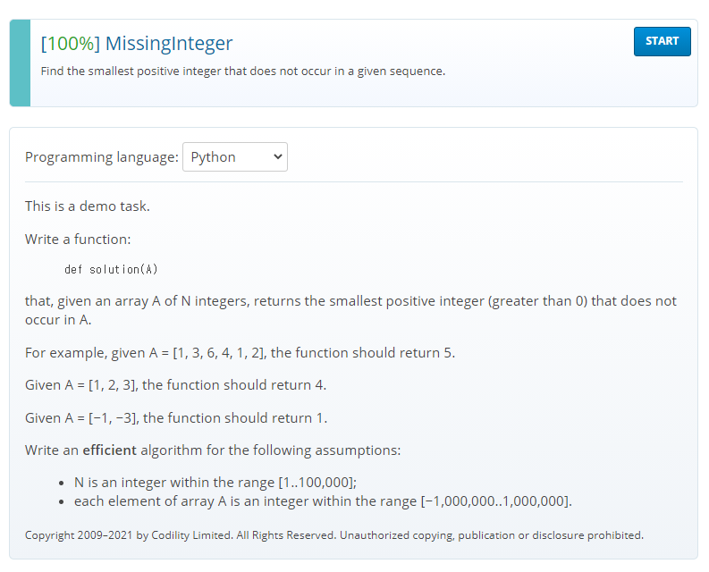
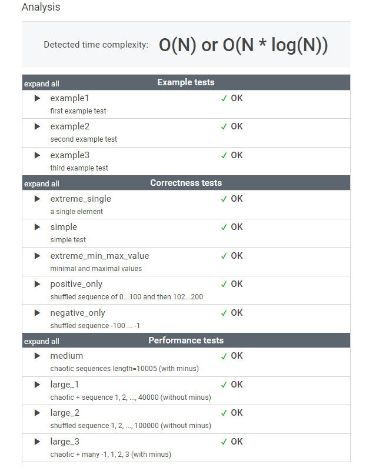
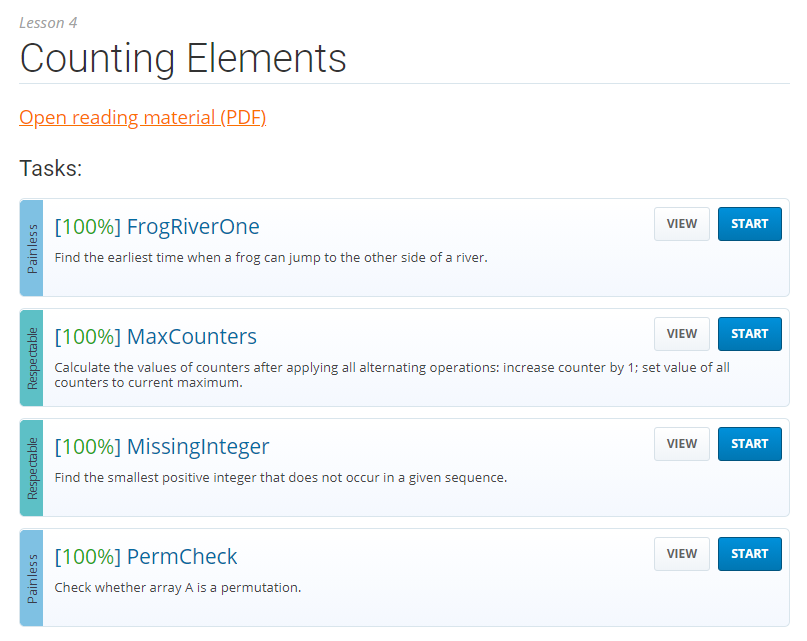
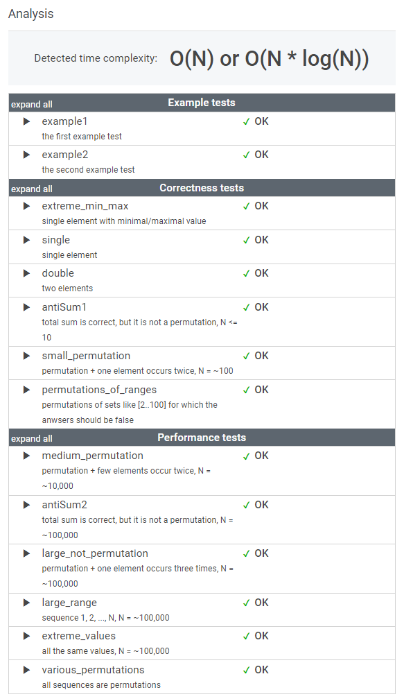

# 6월 19일

## 🚩 

#### ✍ 풀이

- 카운트 배열 하나 만들어서 `A` 배열에 있는 수를 카운트 해줬다.

- `A` 배열에 음수인 것도 있을 수 있으므로 `try` `except`로 음수를 처리했다.
- 필요한 제일 작은 양수를 `index()` 함수를 통해 뽑아낸다.
- 카운트  배열에 0이 없다면 `A`배열에는 100000까지 있기 때문에 그 다음 숫자를 출력한다.

## 🚩

#### ✍ 풀이

- `A` 배열의 크기만큼 카운트 배열 만들어서 카운트 해주기
- 만든 배열보다 값이 크면 0을 리턴
- 카운트 배열에 0이 있으면 0 리턴

