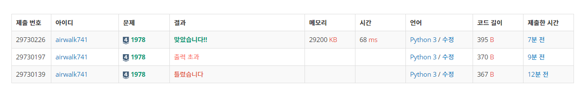

# 6월 1일

[](https://www.acmicpc.net/problem/1978)


- 에라토스의 체를 이용해보고 싶어서 풀어봤다.
- 예전에 면접때는 ''이런게 있나?' 했었는데 기억은 괜찮게 나는 것 같다.
- 처음에는 다른 사람 풀이처럼 하나하나 소수인지 판별하려고 했었다.


```python
n=int(input())

li=list(map(int,input().split()))
cnt=0
for i in li:
    f=True
    if i<=1:continue
    for j in range(2,i):
        if i%j==0:
            f=False
            break
    if f:
        cnt+=1
print(cnt)
```


