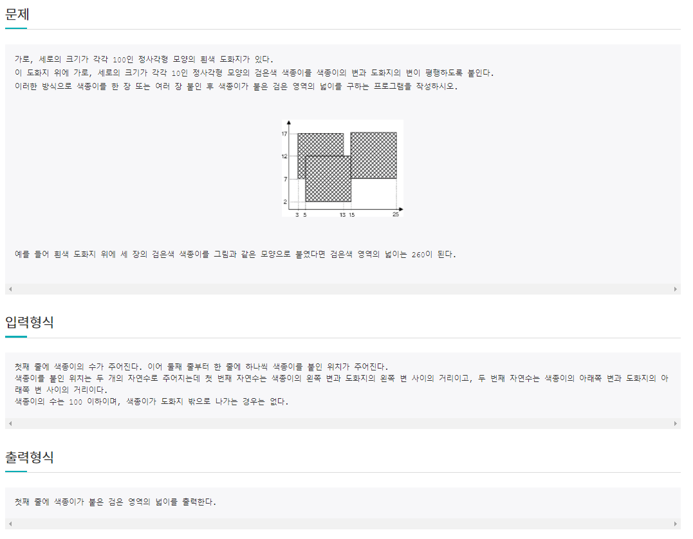
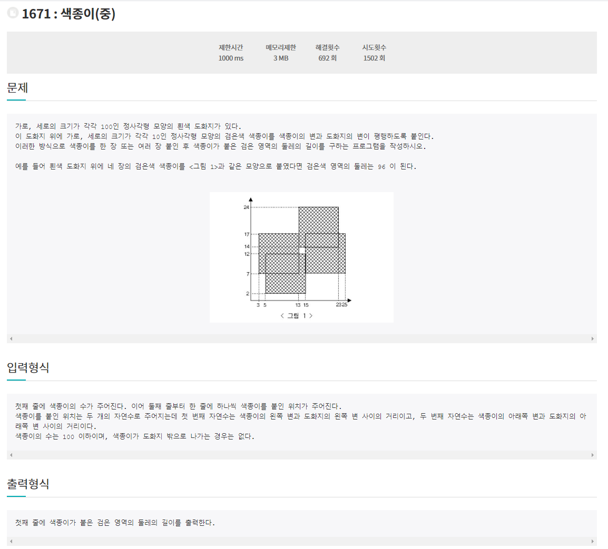
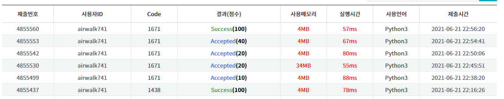

#  6월 21일

## 🚩 1438: 색종이

#### ✍ 풀이

- 흰 종이 배열을 선언하고 0으로 초기화한다.
- 길이가 들어오면 1로 바꿔주고 나중에 합을 구한다.

## 🚩1671: 색종이(중)

#### ✍ 풀이

- 4방향 탐색으로 가로 세로로 1의 개수에 따라 둘레의 길이를 더해줄 값을 다르게 설정했다.
- 둘레는 넓이와 다르게 모서리는 두번 체크해야한다.
- 모서리는 4방향 탐색하면 `cnt`의 값이 **2**이다.
- 모서리가 아니고 둘레이면 4방향 했을 때 `cnt`의 값이 **3**이다.

#### 😒 fail이유

- 4방향 탐색을 대각선으로 했었다.
- 모서리 배열을 따로 만들어 처리 해주었었다.

