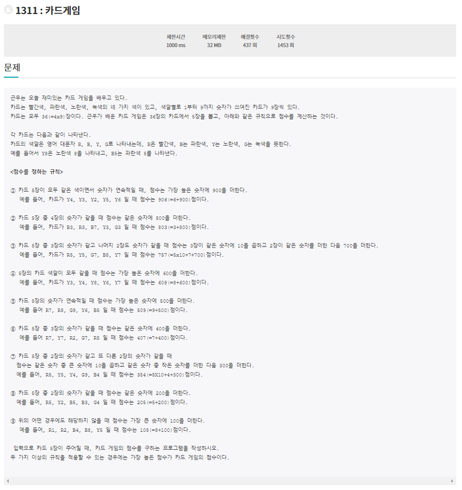

# 6월 22일

## 🚩 1311: 카드게임

[](http://jungol.co.kr/bbs/board.php?bo_table=pbank&wr_id=591&sca=2060)


#### ✍ 풀이

- `hard` 코딩해서 구현했다.


#### 😒 fail 이유

- `hard`코딩을 하다보니 자잘한 오류가 많이 발생했다.
- 함수를 9개 만들어서 오류 찾는데 시간이 많이 걸렸다.


## 🚩 1997: 떡 먹는 호랑이


#### ✍ 풀이

- 피보나치를 거꾸로 생각해서 해결
- 첫째날 변수와 둘째날 변수를 만들어 각각 마지막 날에 몇번씩 더해지는지 구한다
- 그것을 이용해서 방정식으로 해결


## 🚩 공주님을 구하라!

[](https://www.acmicpc.net/problem/17836)


#### ✍ 풀이

- 검을 얻지 못 했을 때의 `visited` 리스트와 검을 가지고 있었을 때의 `visited2` 리스트를 만들어서 구현
- 둘 중 하나라도 공주님을 만나면 `return` 하게 구현
- `q` 에 값이 없으면 `Fail` 리턴
- 시간이 초과 되면 `Fail` 리턴


#### 😒 fail 이유

- 처음에는 검을 가지고 있을 때와 가지고 있지 않을 때의 방문체크를 따고 해주지 않았다.
  - 그러면 검을 가지고 있어도 방문체크가 되어있으면 갈 수 없는 상황이 있다.

- `visited2`를 만들었을 때 이미 지나온 값들은 다시 지나지 않게 하고 싶어 `visited`를 `copy`해서 사용했다.
- 그렇게 되면 갈 수 있는 것도 가지 못하는 경우가 발생

```tex
4 10 100
0 1 1 1 1 2 1 1 1 1
0 0 0 0 0 0 0 0 0 0
1 1 1 1 1 1 1 1 1 1
0 0 0 0 0 0 0 0 0 0
```


