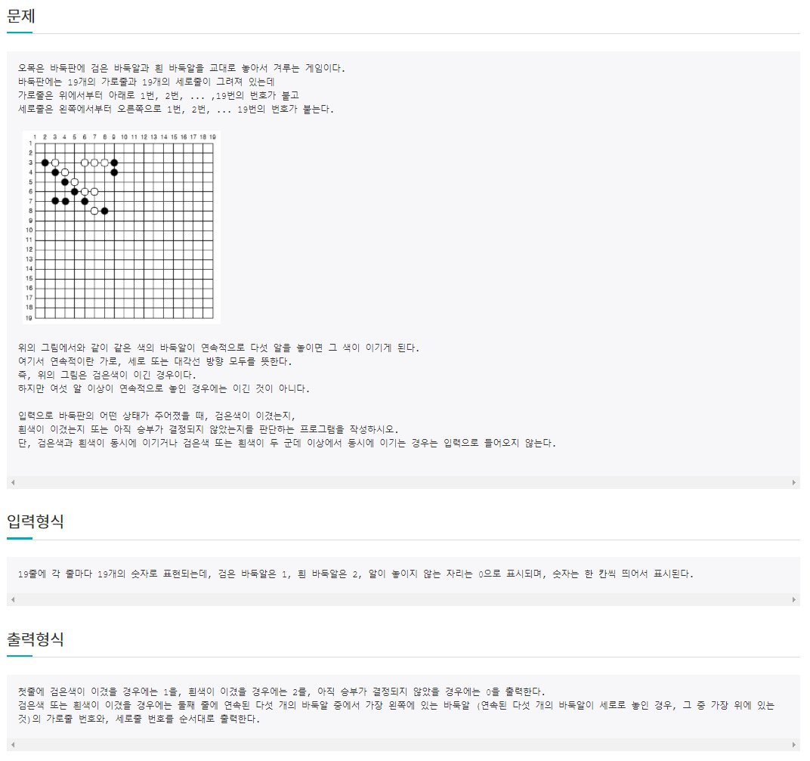

# 6월 23일

## 🚩 오목

[](http://jungol.co.kr/bbs/board.php?bo_table=pbank&wr_id=1006&sca=2060)


#### ✍ 풀이

- 대각선, 가로, 세로를 나눠서 구현했다.
- 바둑돌이 놓아져 있으면 그 바둑돌에 따라 왼쪽 오른쪽으로 바둑돌의 개수를 측정한다.
- 바둑돌이 5개라면 이긴 `player`와 가장 왼쪽 바둑돌  `위치`가 출력이 된다.


#### 😒 fail 이유

- 바둑돌이 6개 이상일 수 있다는 것을 체크 하지 않았다.
- 6개 체크 할때 단순히 세로라면 아래로만 가로라면 오른쪽으로만 체크하게 되어서 그 전것이 체크가 되지않아 에러가 발생
- 에러 코드

```python
def winner(r, c, player):
 
    # 대각선
    buttom_cross = 0
    above_cross = 0
    for i in range(5):
        if r + i < 19 and c + i < 19:
            if arr[r + i][c + i] == player:
                buttom_cross += 1
 
        if r - i > 0 and c + i < 19:
            if arr[r - i][c + i] == player:
                above_cross += 1
 
    if above_cross == 5 or buttom_cross == 5:
        return player
 
    # 가로, 세로
    width = 0
    height = 0
    for i in range(5):
        if r + i < 19:
            if arr[r+i][c] == player:
                width += 1
        if c + i < 19:
            if arr[r][c+i] == player:
                height += 1
 
    if width == 5 or height == 5:
        return player
 

arr = [list(map(int, input().split())) for _ in range(19)]
 
winner_check = 0
 
for i in range(19):
    for j in range(19):
        if arr[i][j]:
            if winner(i, j, arr[i][j]):
                winner_check = 1
                print(arr[i][j])
                print(i+1, j+1)
                break
    if winner_check:
        break
else:
    print(0)
```


## 🚩 벽을 부수고 이동하기


#### ✍ 풀이

- 3차원으로 방문체크 리스트를 만들어 벽을 격파하고 이동할 수 있을 때와 격파하지 못하는 경우에 이동할 수 있는 경우를 나눠서 구현했다.


#### 😒 fail 이유

- 격파하고 `cnt` 1 만큼 줄여주어서 다른 이동때도 `cnt`에 0 이 들어가는 오류가 발생


