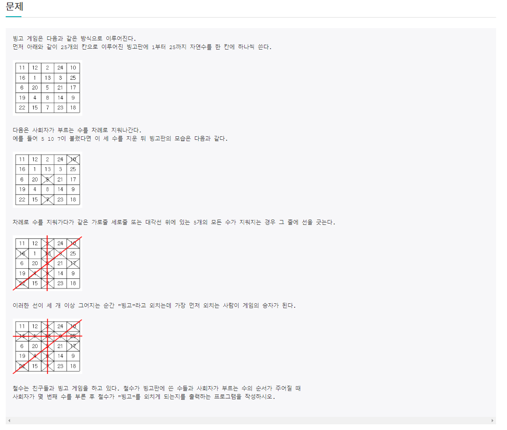
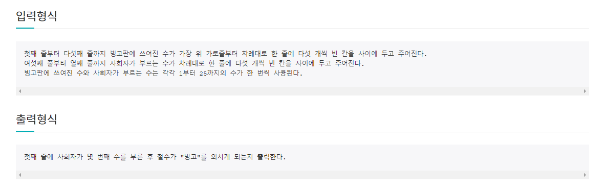
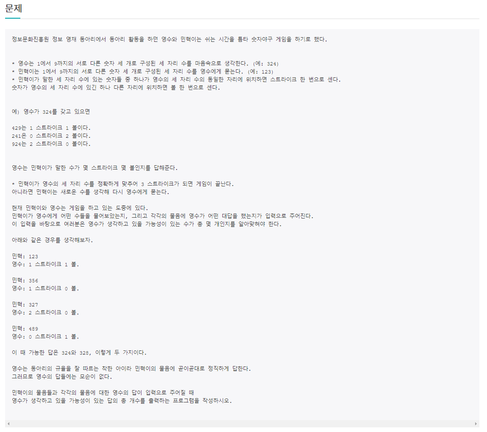
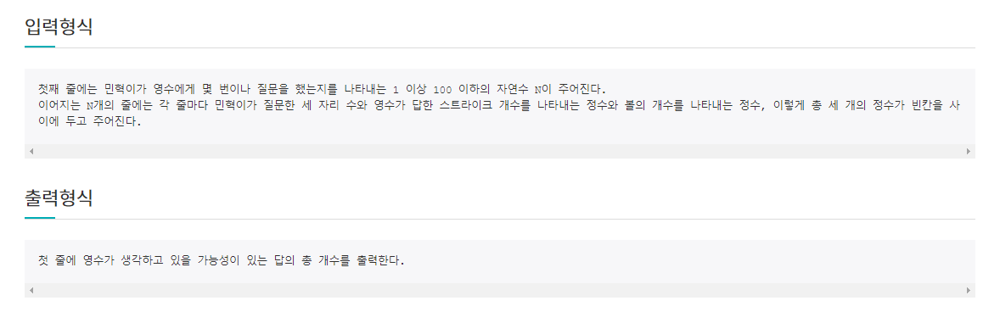

# 6월 24일

## 🚩 빙고

#### ✍ 풀이

- 사회자가 숫자를 부르면 해당 숫자를 0으로 만들어 주었다.
- 대각선, 가로세로 함수를 만들어 해당 줄의 합이 0이 되면 빙고의 개수를 늘려주었다.
- 줄의 개수를 또 셀 수 있는 것을 방지 하기 위해 행, 열 배열을 따로 만들어 셌으면 배열에 넣어 주었다.

#### 😒 FAIL 이유

- 문제를 이해하지 못했음 => 몇번째로 불리는 것을 몇번째 값이 불리는지로 잘못 이해
- 이미 체크한 빙고 줄을 또 세는 오류 발생

## 🚩 숫자 야구

#### ✍ 풀이

- 야구 공 전체 배열을 만든다.
- 민혁이가 말할 때마다 야구공 하나하나 대입해서 영수의 대답과 같은지 비교한다.
- 같으면 `PASS` 다르면 `0`으로 바꿔준다.
- 출력 할때 `0`을 제외한 공의 개수를 출력하면 된다.

