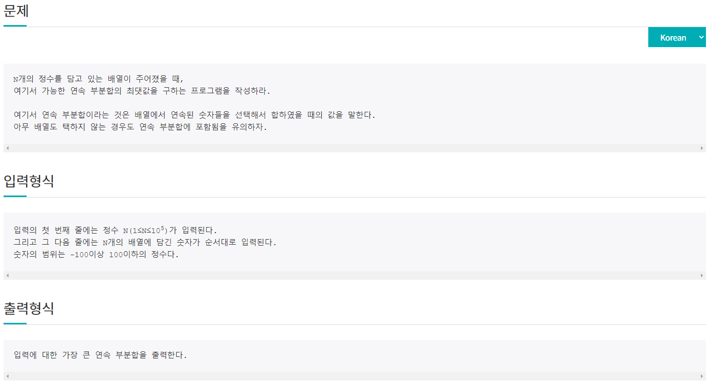
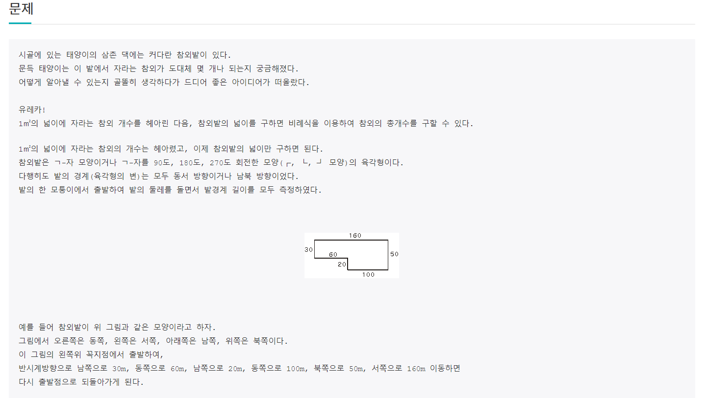
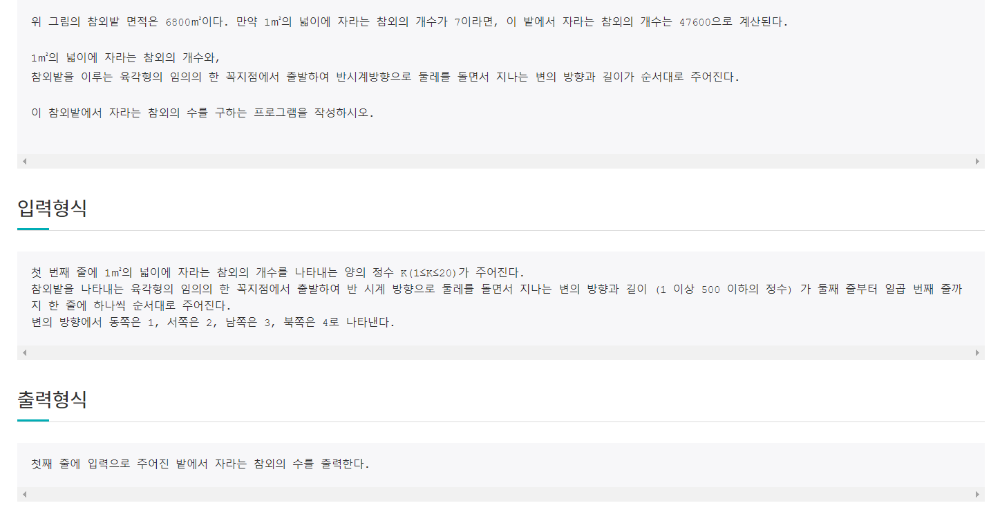

# 6월 25일

## 🚩 연속부분합 찾기

#### ✍ 풀이

- `dP`를 사용해서 풀어야 한다고 인지는 했는데 활용을 잘 못했다.

- 구글링을 해보니 `Kadanes algorithm` 이라는 알고리즘으로 풀어야하는 문제였다.

  **https://sustainable-dev.tistory.com/23** 

- `dP`를 알면 문제를 많이 풀 수 있으니 조금씩 연습해 부는게 좋을 듯하다...

## 🚩 참외밭

#### ✍ 풀이

- 가로 세로 가장 큰 길이를 찾는다
- 큰 길이와 붙어 있지 않는 가로 세로 길이를 찾는다
- {(큰 가로 세로의 넓이) - (연결되어 있지 않는 가로 세로 길이의 넓이)} * (면적 당 과일 수 )

#### 😒 FAIL 이유

- 붙어 있지 않은 가로 세로의 길이를 찾는데 오류가 계속 발생
- 인덱스 생각을 잘 해야했었음

