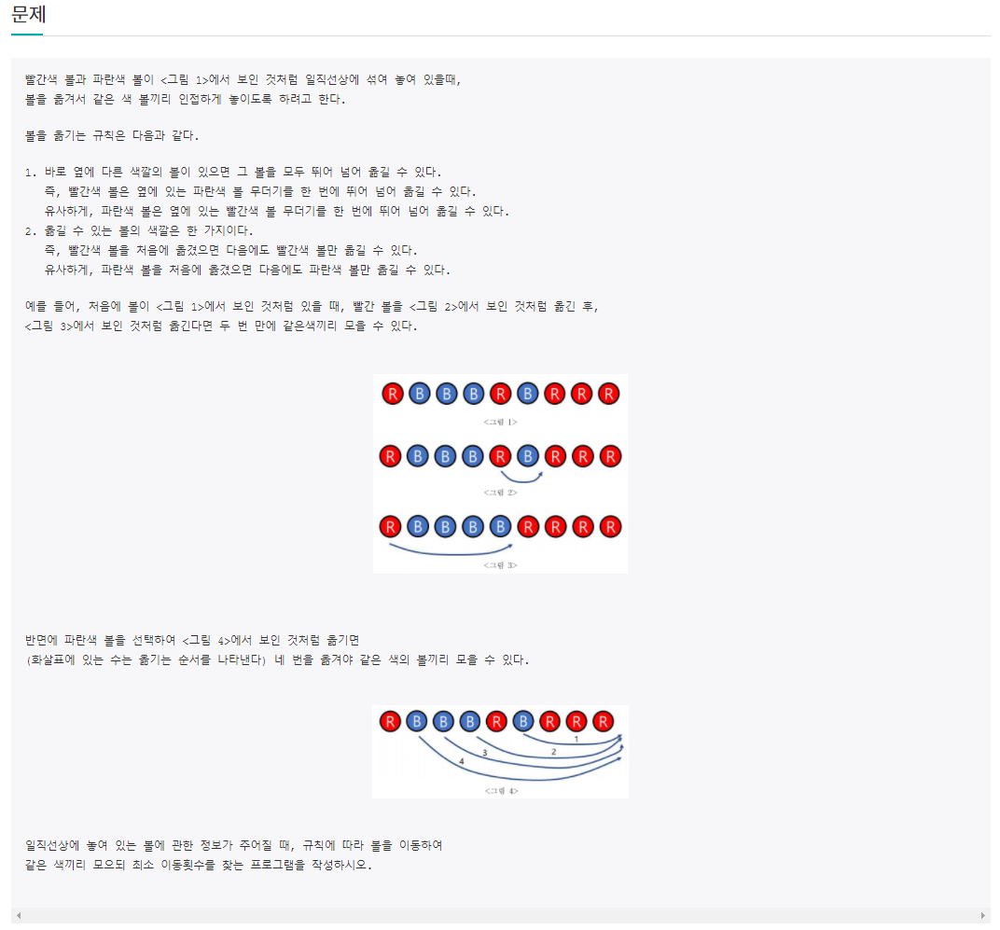
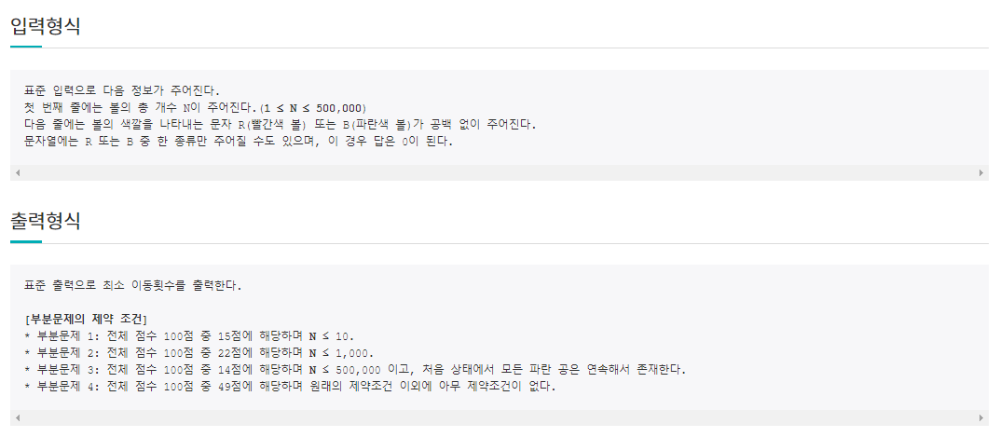

# 6월 26일

## 🚩 볼 모으기

[](http://jungol.co.kr/bbs/board.php?bo_table=pbank&wr_id=2749&sca=2060)[](http://jungol.co.kr/bbs/board.php?bo_table=pbank&wr_id=2749&sca=2060)


#### ✍ 풀이

- 맨앞 맨끝의 공이 같은지 다른지에 따라 다르게 구현
- 같다면 앞에 같은 색깔의 공이 모여 있는 개수와 뒤에 모여 있는 개수를 비교해서 많은 쪽을 선택
- 선택 후 모여있는 공 빼고 나머지 같은 공의 개수를 출력
- 다르다면 각각 앞쪽 뒤쪽 따로 구해서 최소인 것을 출력


#### 😒 FAIL 이유

- 왜인지 모르겠다...

```
333
RBRRRRRRRRBRBBBRRBBBRRBRBBBBRRBRBBBBRBBRRRBBRRBRBRBBBRRBBBBRRBRRRBRRRRRBBBRBRBRBBRRBRBBBBRRBRRRBBRBRRRBRRRRRBRRBRBRBRBRRRBRBBRRBBRRRRRBRRRRRBBBRRRBRBRRBBBRRRRBRRBBRRRBBBRBBBBRBBBRRRRRRBRBBRRRRBRRBBBBBRBRBBRBRRRBRBBRRBBRRRRRBRBBRBRBRBRRRBBRBBRBBRRBBBBRRBBBBBRRBBBBBRBBRBRBBRBBBRBRRRBBRRBBRBRBBRBRRRRBRBBRRRRBBBRRBRBBBBBRRBBBRRRBBRRBBR
```

- 이거에서 오류...


