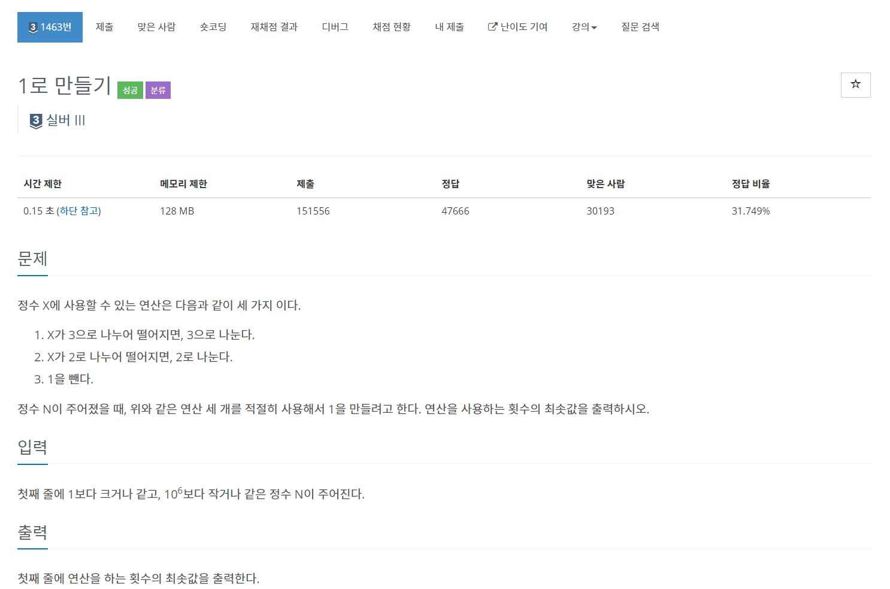
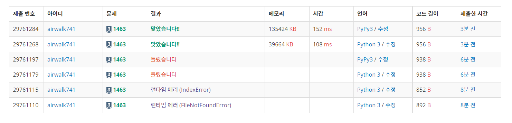

# 6월 2일

[](https://www.acmicpc.net/problem/1463)


- 숨박꼭질과 같은 문제이다.
- 숨박꼭질을 풀어보기 전에 이 문제를 먼저 접근했다면 숨박꼭질 문제도 쉽게 풀었을 것 같다.

- 다른 사람들은 `DP`를 이용해서 풀었다.
- 언젠가 보면은 백준 풀때 사람들이 `DP`를 많이 이용하는 것 같다.
- `DP` 공부해서 익숙해져보자


```python
# dp
def dp(n):
    if n in memo:
        return memo[n]
    # 나머지를 더해준 이유 짐작: 7의 경우 2, 3으로 나누어 지지 않으므로 -1를 무조건 해줘야한다.
    # 이 경우를 나머지로 더해주는 것으로 짐작된다.
    m = 1 + min(dp(n // 2) + n % 2, dp(n // 3) + n % 3)
    memo[n] = m
    return m


memo = {1: 0, 2: 1}
n = int(input())
print(dp(n))
```


#### fail 이유

- 입력에서 1보다 크거나 같은 수가 들어온다고 그랬는데 1보다 큰 값이라고 읽었다.
- 나중에 1도 포함된 입력값을 처리해줬더니 **PASS**가 나왔다.





