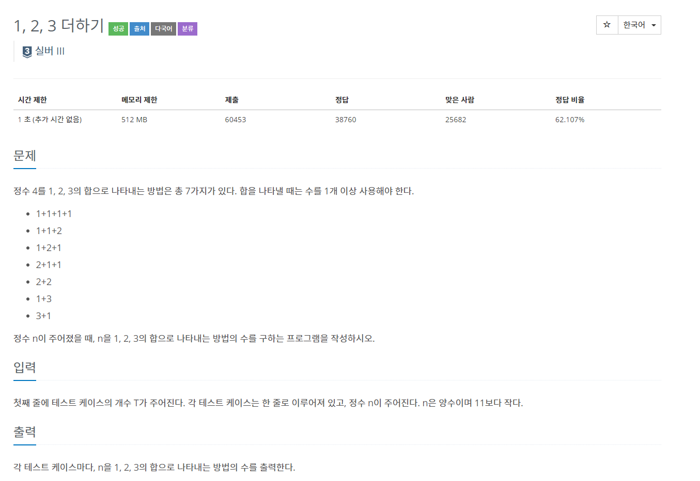
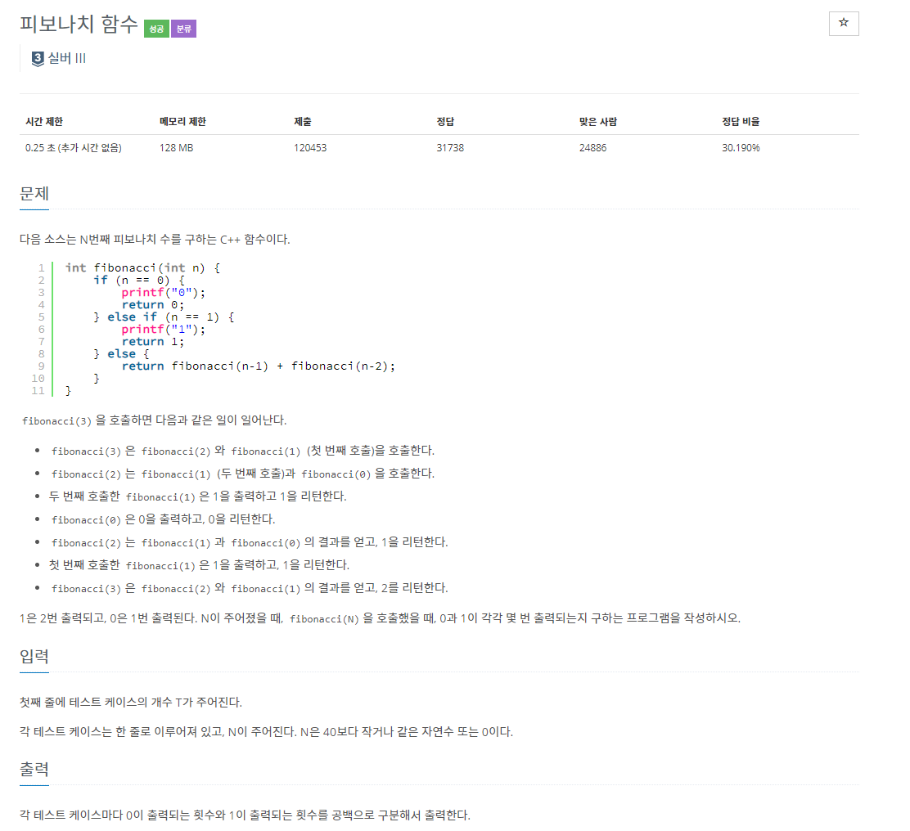
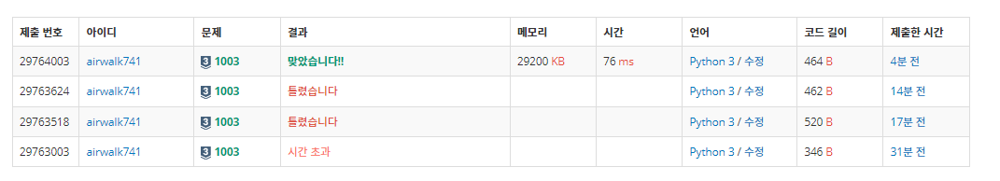

# 6월 2일

# 1.

[](https://www.acmicpc.net/problem/1463)


- 숨박꼭질과 같은 문제이다.
- 숨박꼭질을 풀어보기 전에 이 문제를 먼저 접근했다면 숨박꼭질 문제도 쉽게 풀었을 것 같다.

- 다른 사람들은 `DP`를 이용해서 풀었다.
- 언젠가 보면은 백준 풀때 사람들이 `DP`를 많이 이용하는 것 같다.
- `DP` 공부해서 익숙해져보자


```python
# dp
def dp(n):
    if n in memo:
        return memo[n]
    # 나머지를 더해준 이유 짐작: 7의 경우 2, 3으로 나누어 지지 않으므로 -1를 무조건 해줘야한다.
    # 이 경우를 나머지로 더해주는 것으로 짐작된다.
    m = 1 + min(dp(n // 2) + n % 2, dp(n // 3) + n % 3)
    memo[n] = m
    return m


memo = {1: 0, 2: 1}
n = int(input())
print(dp(n))
```


#### fail 이유

- 입력에서 1보다 크거나 같은 수가 들어온다고 그랬는데 1보다 큰 값이라고 읽었다.
- 나중에 1도 포함된 입력값을 처리해줬더니 **PASS**가 나왔다.


# 2.

[](https://www.acmicpc.net/problem/9095)


- 스터디 하면서 조합, 순열 문제에 조금 익숙 해졌나보다
- 문제를 보고  순열을 이라고 생각해서  바로 해결했다.


# 3.

[](https://www.acmicpc.net/problem/1003)


- 그냥 피보나치를 이용한 함수로 구하게 되면 쓸데 없는 연산까지 해야되서 시간초과가 발생한다

- 0과 1의 개수에 따른 `visited` 배열을 만들어 `n`의 값을 인덱스라고 생각하고 구했다.
- `n`이 40 이하이기때문에 작은 수라고 생각해서 40까지 다 구하고 출력해줬다.


#### fail 이유

- 시간초과가 발생 할 것 같았지만 그래도 한번 시도 해봤음
- `if`문의 조건을 잘 못 주었다.

```python
 if n = 2:
```


- 다행히 다른 사람 풀이 (시간이 제일 적게 절린 풀이)도 나랑 비슷하게 풀었다.
- 다만, 나처럼 배열을 2개 만드는 것이 아닌 그리고 40개까지 구하는 것이 아닌 풀이로 해결했다.
  - 2차원 배열 선언

```python
import sys
T = int(input())
dp = [[1,0], [0,1]]
q = [int(sys.stdin.readline()) for _ in range(T)]

for i in range(2,max(q)+1):
    dp.append([dp[i-2][0]+dp[i-1][0], dp[i-2][1]+dp[i-1][1]])
for i in q:
    print(dp[i][0], dp[i][1])
```





