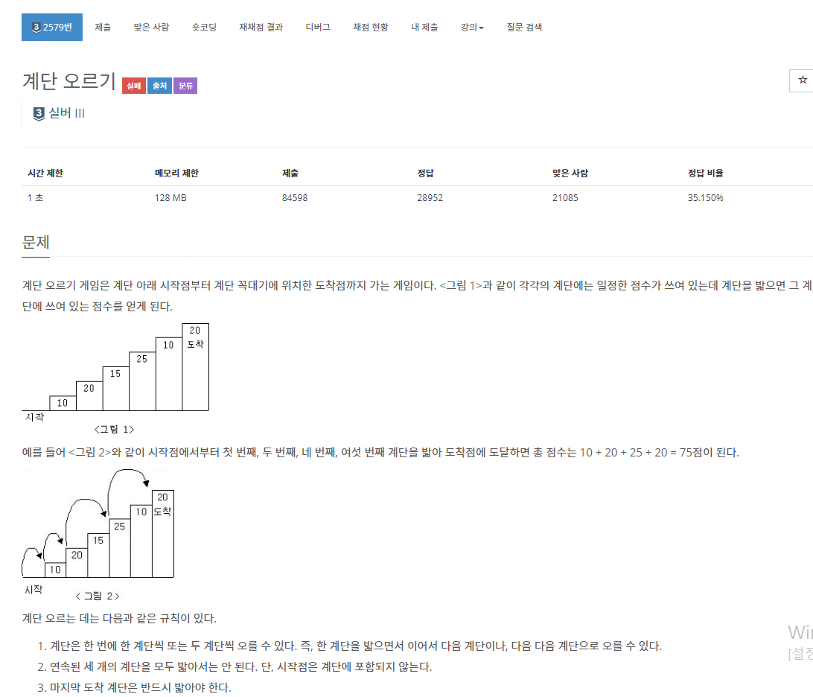
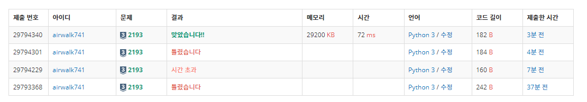

# 6월 3일

# 1.

[](https://www.acmicpc.net/problem/2579)


- `DFS`를 이용해서 풀려고 했는데 풀면서 이거 시간초과 날거 같은데... 하니까 진짜 시간 초과
- 백트래킹으로 해결하려 했지만 해결하지 못했다.
- 결국 구글링을 통해 확인해 본 결과 `DP`를 이용해서 푸는 문제 였다.
- 빨리 `DP`를 공부 해야될 것 같다.
- 또한 점화식이나 손으로 규칙을 찾았더라면 뭔가 문제를 풀 수 있었을 것 같다는 아쉬움이 든다.
- 다음에는 손으로도 한번 해봐야겠다.


#### FAIL 코드

```python
def search(score, target, one_cnt, remain):
    global res

    if res > score + remain:
        return

    if target == n:
        res = max(res, score)
    elif target < n:
        if one_cnt < 2:
            search(score + arr[target], target + 1, one_cnt + 1, remain - arr[target])

        search(score + arr[target], target + 2, 0, remain - arr[target])


n = int(input())

arr = []

for _ in range(n):

    arr.append(int(input()))

res = 0

search(0, 0, 0, sum(arr))

print(res)
```


# 2.

[](https://www.acmicpc.net/problem/2193)


- 하나하나 구하다가 뭔가 피보나치처럼 늘어나는 것을 느끼고 피보나치로 구현했다
- 설마 했는데 정답이였고 다른 사람들 풀이 또한 피보나치처럼 풀었다,
- 이친수는 피보나치인가보다


