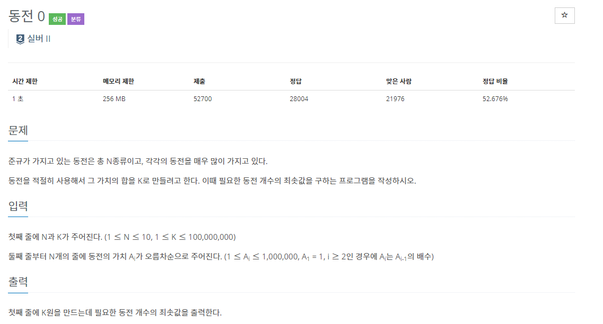
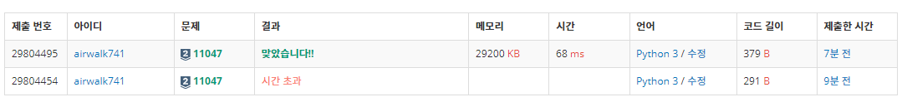
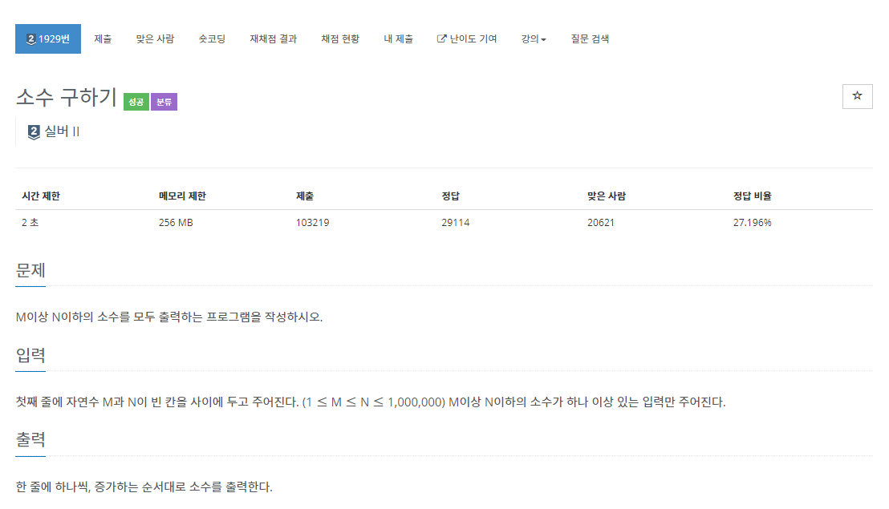
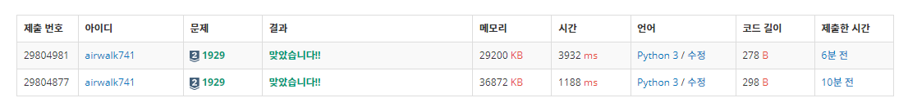

# 6월 4일

## 🚩 

[](https://www.acmicpc.net/problem/11047)


### ✍ 풀이

- 찾는 금액보다 작고 가장 큰 동전을 나눠 계산 후 출력하기


### 😒 fail 이유

- 처음에 찾는 금액보다 큰 값을 찾아서 그 전 인덱스로 나눠서 계산했다.
-  `K`보다 큰 동전이 없을 수도 있다는 것을 생각하지 않아서 `FAIL`이 났다.


### 🎁 다른사람 코드

- 접근 방법은 똑같지만 `pop()` 를 통해서 굳이 다시 해야하지 않을 계산들을 줄였다.

```python
N, K = map(int, input().split())

Coins = []
for i in range(N) : Coins.append(int(input()))


ans = 0
while K > 0 :
    coin = Coins.pop()
    ans += K // coin
    K %= coin

print(ans)
```





## 🚩

[](https://www.acmicpc.net/problem/1929)


### ✍ 풀이

- 에라토스테네스의 체를 이용해서 `N`까지의 숫자까지 소수를 구한다.
- `M` 부터 `N`까지  `for`문을 돌려서 소수인 것만 출력한다.


### 🎁 다른 사람 풀이

- 백준사이트 다른 사람 코드는 해석하기 좀 어려워서 구글링을 해보았다.
- 대부분 `Prim` 알고리즘을 사용해서 해결했다.
- 그래도 내가 푼 풀이가 시간이 더 적게 걸렸다.


```python
def isPrime(num):
    if num==1:
        return False
    else:
        for i in range(2, int(num**0.5)+1):
            if num%i == 0:
                return False
        return True

M, N = map(int, input().split())

for i in range(M, N+1):
    if isPrime(i):
        print(i)
```

✔

