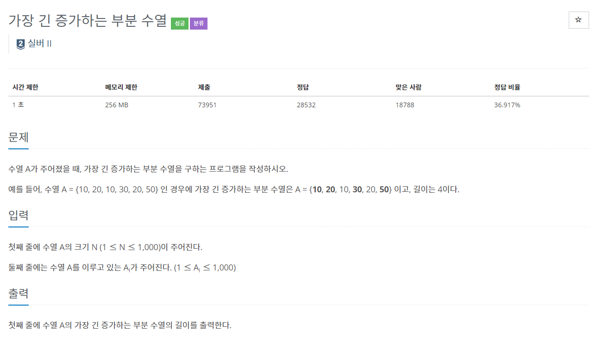
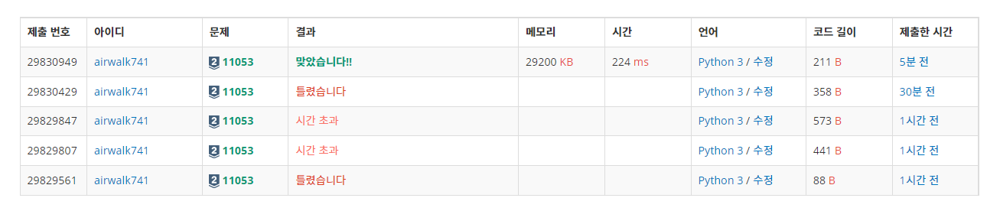

# 6월 5일

## 🚩

#### ✍ 풀이

- Longest Increasing Subsequences 라고도 불리며 DP로 풀 수 있는 보편적인 문제라고 한다.
- 처음에 수열로 해서 풀었는데(햄버거 문제)  당연히 시간초과가 나서 이걸 어떻게 풀지 하고 구글링했다...

- `perm`이라는 배열을 하나 만들어서 입력으로 들어온 배열의 인덱스를 참조한다.
- `perm`은 각 인덱스에서 최대의 길이를 가질 수 있는 값을 말한다
- 그러므로 `perm` 의 인덱스가 커지면 **+1**만큼씩 증가하는 것이다.
- 요즘 백준을 풀면서 DP가 자주 보이는 듯 하다

