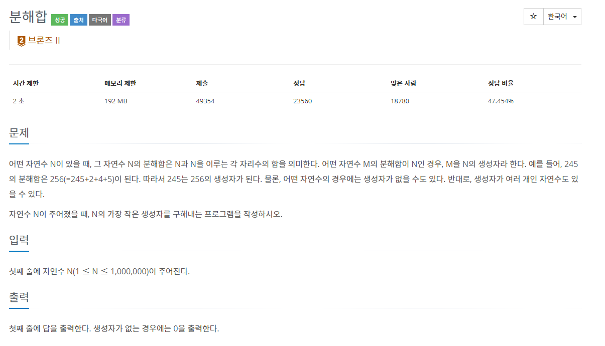
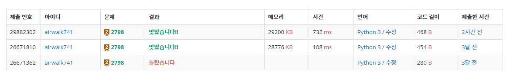
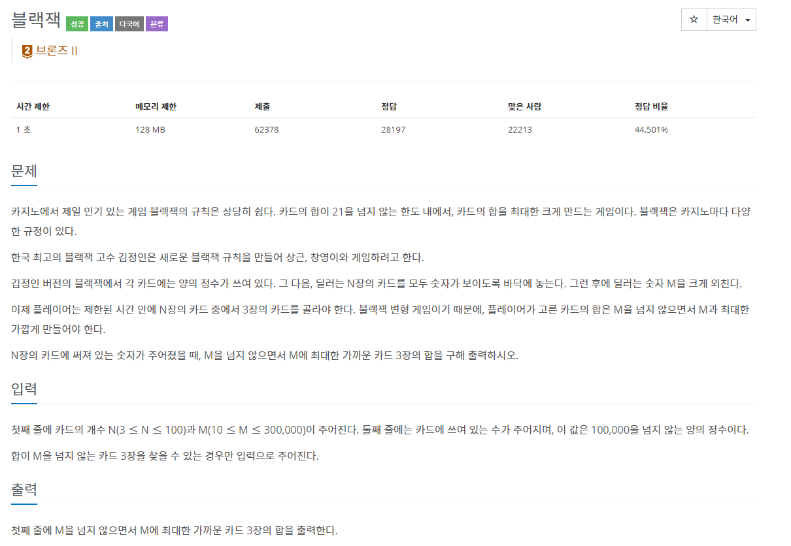
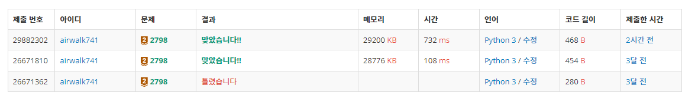

# 6월 7일

# 🚩

#### ✍ 풀이

- 각 자리수는 최대 9를 가질 수 있다는 걸 캐치
- 한 자릿수와 두 자릿수에서 에러 날 수 있으므로 `max()`를 통해 해결했음

#### 😒 FAIL 이유

- 자릿수 길이 만큼 9를 곱해서 빼줬는데 한 자릿수와 두 자릿수에서 음수가 나올 가능성을 생각 안해줬다.

# 🚩

#### ✍ 풀이

- 조합을 통해서 해결했다
- 전에 해결했을 떄는 3개 뽑는 것이기 때문에 3중 `for`문을 이용해서 풀었다.
- 뽑는 개수가 적으면 `for`문을 써도 시간이 적게 걸리는 것 같다.

