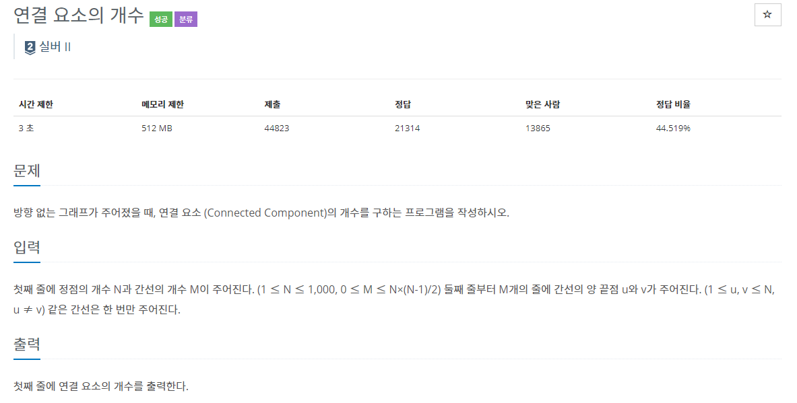
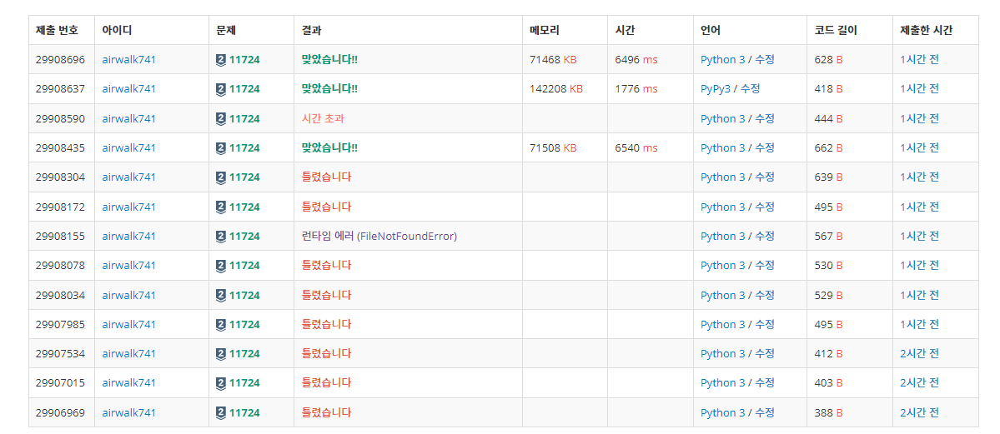
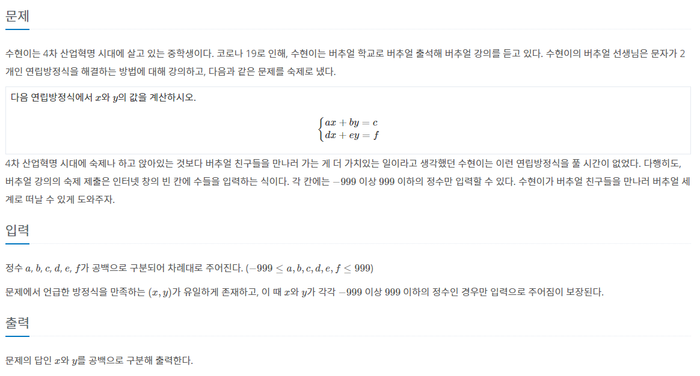
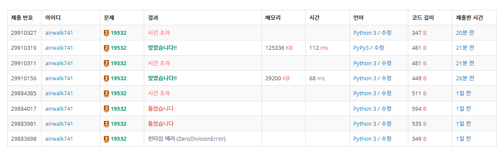

# 6월 8일

# 🚩

#### ✍ 풀이

- 빈 N차형 배열을 선언하고 입력으로 들어온 노드들을 양방향으로 체크해줬다.
- 입력으로 들어오지 않는 숫자를 체크하기 위해 `cnt` 변수를 만들어 체크
- `DFS` 함수를 만들어 `while`문이 돌 때마다 해당 노드와 연결된 노드를 방문 체크
  - 이것으로 무리의 개수 구함
- 출력을 **노드의 개수 + 무리의 개수 - 입력으로 들어온 숫자** 해주었다

#### 😒 fail 이유

- `find_set()` , `union()` 함수를 잊어버렸다.
  - 복습 필요
- 무 방향이라서 양방향 체크를 해줘야하는데 그러지 않았다.
- 들어오지 않는 숫자 ( 무리에 포함되지 않은 노드 )를 체크 해 주지 않았다.

# 🚩

#### ✍ 풀이

- 일반 2차 방정식처럼 해결했다.

#### 😒 fail 이유

- `a`가 0일 때를 체크해 주지 않아 `zerodivision` 발생
- **pypy**는 통과하지만 **python3**는 시간초과
  - 2중 `for`문으로 해결했음

