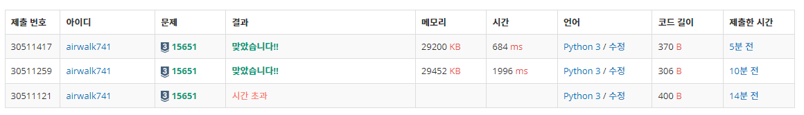

# 6월 30일

## 🚩 N과 M(3)

#### ✍ 풀이

- 재귀를 이용해서 리스트에 담아두고 m의 길이가 되면 바로 출력하게 해주었다.
- 리스트 말고 String으로 구현하면 더 빠르다

#### 😒 FAIL 이유

- 리스트에 담고 `result`라는 변수를 만들어 조건에 맞는다면 넣었다.
- 조건
  - 사전 순서로 `res`가 되어 있는지 확인
  - `result`에 없는지 확인

