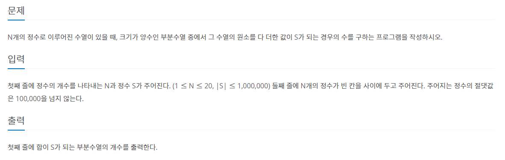

# 7월 10일

## 🚩 부분수열의 합

[](https://www.acmicpc.net/problem/1182)


#### ✍ 풀이

- 백트레킹을 해야 통과 될 줄 알았는데 안해도 통과되서 신기했다..
- 물론 시간복잡도가 크긴했다.
- 비트를 활용한 부분집합을 구해 `S`와 같다면 `cnt`를 추가했다.


#### 🎁 다른 풀이

```python
N, S = map(int, input().split())
D = list(map(int, input().split()))


def solve():
    A = [0]
    for i in range(N):
        length = len(A)
        for j in range(length):
            A += [D[i] + A[j]]
        # A += [D[i] + j for j in A]

    ans = A.count(S)
    if S == 0:
        ans -= 1
    print(ans)

solve()
```

- 방식은 생각 해 봤었는데 어떻게 코드를 구현할지 몰랐었다.

- `A` 배열에 원소 하나씩 탐색 할때마다 `A` 배열에 있는 원소들을 각각 더해서 다시 담아준다.

- 그러면 쓸데 없이 나처럼 뽑았던 원소들을 다시 배열에 넣고 하는 일이 적어진다.

```python
    for i in range(N):
        for j in A:
            A += [D[i] + A[j]]
```

- 이렇게 하면 A의 원소가 추가될 때마다 `for`문의 길이가 계속 증가해 무한 루프를 만든다는 것을 주의하자

  


