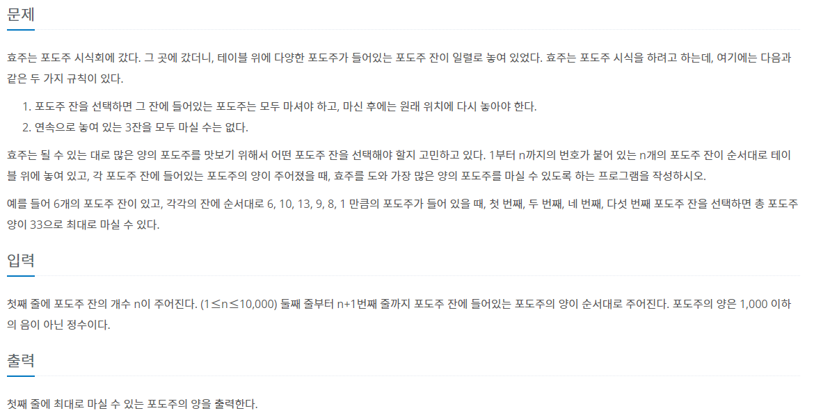

# 7월 14일

## 🚩 포도주 시식

#### ✍ 풀이

- `DP` 기본 문제
- 연속 3번 먹으면 안되기 때문에
  - O O X O
  - O X O
  - X
- 이 세개의 경우의 수 중에서 가장 큰 값을 `dp`라는 배열에 남아두었다.

#### 😂 FAIL 이유

- 아직... `dp` 푸는 것이 많이 부족한 것같다.
- 앞으로 `dp`문제를 많이 풀어야 할 것
