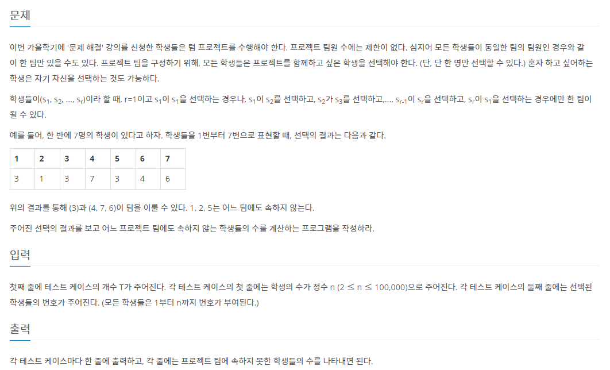

# 7월 16일

## 🚩 텀 프로젝트

#### ✍ 풀이

- 어제 내가 생각해낸 아이디어가 맞았다.

- `DFS`로 재귀를 통해서 푼건 아니지만 `백트레킹`으로 해결한게 더 맞지 않나 싶다.

- 어제와 다른 것은 `LIST`는 `DIC`보다 시간복잡도가 더 크다는 스터디 원의 말을 듣고

  오늘 `LIST`에서 `DIC`로만 바꿔줬을 뿐인데  `PASS`가 나왔다.

- 아... 쓰면서 내가 착각을 했다.

- 헷갈리지 않게 주의 하자

- 어제는 `team`이라는 변수를 방문하지 않은 팀원이라면 계속 `n+1`만큼 생성했다.

- 여기서 `시간초과`가 나온것인다. ( N <= 100,000)

- 그래도 검색을 위한 시간 복잡도는 `dict`가 더 빠르다는 것을 알아두자

[시간복잡도](https://lsh424.tistory.com/59)

