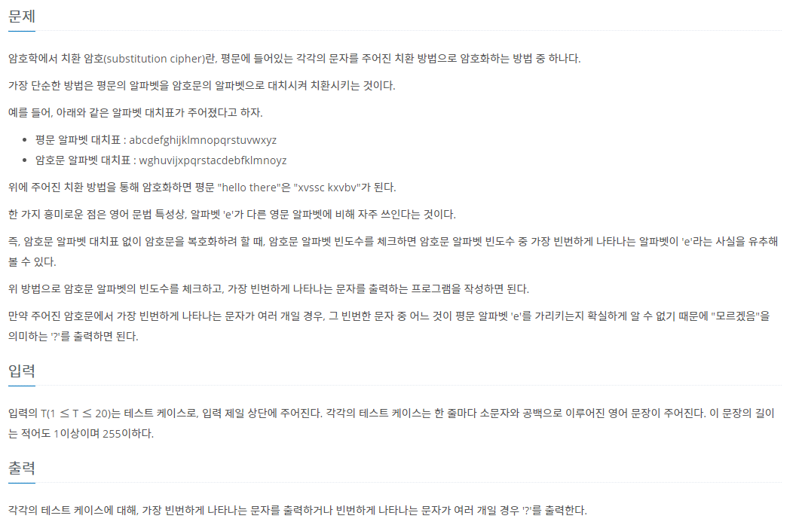

# 7월 17일

## 🚩 경고

[](https://www.acmicpc.net/problem/3029)


#### ✍ 풀이

- 입력이 한번에 `시:분:초`로 들어오는 것을 `:` 을 기준으로 배열에 숫자만 넣어둔다.
- `시, 분, 초` 마다 단위에 따라 계산을 해준다.


#### 😒 FAIL 이유

- 최소 1초 기다려야하기 때문에 시간이 같다면 24시간을 출력해야 했었다


#### 🎁 다른 사람 풀이

- 출력을 통해  앞자리 `0` 다르게 구현했다.

```python
print("%02d"%hour+":"+"%02d"%minute+":"+"%02d"%second)
```

[참고자료](https://hyjykelly.tistory.com/65)


## 🚩 복호화

[](https://www.acmicpc.net/problem/9046)


#### ✍ 풀이

- `DICT`를 이용해서 개수 체크
- 가장 많은 개수의 알파벳이 두 개이상 있으면 `?` 출력 아니면 알파벳 출력


#### 😒 FAIL 이유

- 가장 많은 개수를 이상하게 해 줬다...

```python
max_num = frequency[string[i]]
```

- 계속 갱싱하는데 이전 `max_num` 값이 더 큰 경우를 생각 안했다... 왜 이렇게 했지?


####  ✍ 다른 풀이

- `DICT`로 안풀려서 `LIST`로 다시 구현해서 해결

```python
for _ in range(int(input())):


    string = input()

    alpa = [0] * 26

    for i in string:

        if i != ' ':
            alpa[ord(i) - ord('a')] += 1


    max_num = max(alpa)

    if alpa.count(max_num) > 1:
        print('?')
    else:
        print(chr(alpa.index(max_num) + ord('a')))
```


