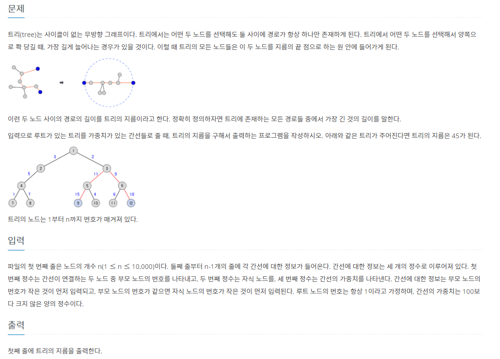

# 7월 19일

## 🚩 트리의 지름

#### ✍ 풀이

- 루트 `1번 노드`는 무조건 있으니까 거기서부터 최대 거리의 `Idx`를 구한다.
- 그 `idx`에서의 최대 거리를 구한다.
- 마치 롯데리아는 최대거리가 ssafy인데 ssafy는 최대거리가 준서님네 집인 것

#### 😒 FAIL

- 왜 틀린지 잘 모르겠다...
- 맞게 푼거 같은데 `85%` 에서 fail이 발생한다..,
- 다음에 다시 도전 해보자...