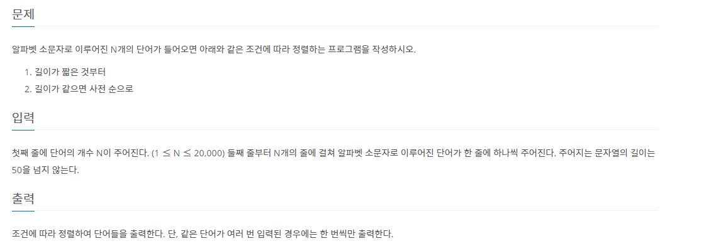
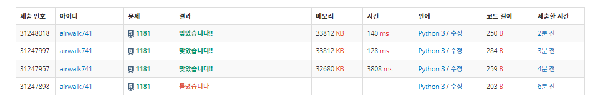

# 7월 20일

## 🚩 그룹 단어 체커

[](https://www.acmicpc.net/problem/1316)


#### ✍ 풀이

- 첫 번째 단어를 미리 넣어 둔다.
- 두 번째 단어부터 `repeat` 에 있는 단어인지 체크한다.
- 있다면 한번 나온 단어이다.
- 연속한 단어는 그룹으로 할 수 있지만 연속하지 않는다면 그룹단어가 될 수 없다.


#### 😒 FAIL 이유

- 반대로 구했었음


## 🚩 단어 정렬

[](https://www.acmicpc.net/problem/1181)


#### ✍ 풀이

- `sort`와 `lambda` 함수를 이용해서 해결

```python
strings.sort(key=lambda x: (len(x), x))
```


#### 😒 FAIL

- 중복 출력하면 안된다는 것을 읽지 않았다.


#### 🎁 `DICT`

- 처음에는 배열로 풀었는데 생각해보면 `DICT`가 더 빠를 것 같아 고쳤는데 역시나였다.



