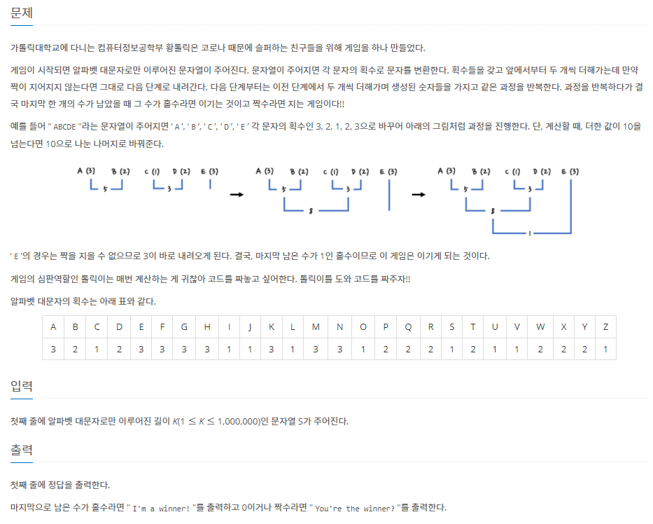
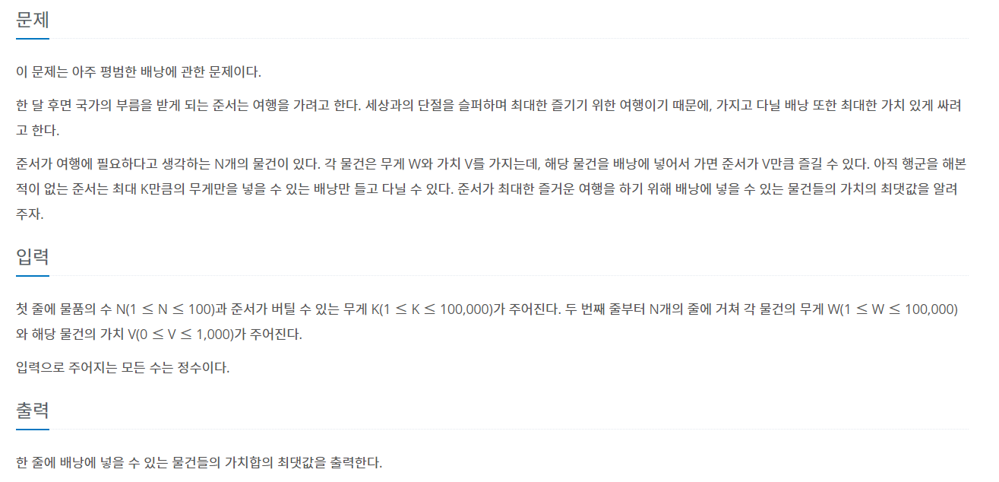

# 7월 21일

## 🚩 이 구역의 승자는 누구야!?

[](https://www.acmicpc.net/problem/20154)


#### ✍ 풀이

- `ord`를 이용해서 각 문자의 획수를 `friend`라는 배열에 반영했다.

- 두 개씩 더해서 다음 단계로 가는 것이 아닌 바로 `SUM`함수를 써서 합계를 구한 후 홀수면 이긴다를 출력했다.


## 🚩 평범한 배낭

[](https://www.acmicpc.net/problem/12865)


#### 😒 풀이

- `DP` 문제인건 알겠다....
- 하지만 못 풀겠다... 아직 많이 부족한 것 같다.
- 물건을 뽑았다면 `visited`에 방문체크를 하고 다음 `idx` 때 거꾸로 빼줘서 최대값으로 갱신 해줬다.

```
4 7
6 13
4 8
1 0
3 6
```

- 이 테스트 케이스에서 망했다. 아마 더 다른 케이스에서도 안될 것 같다.
- 차근차근 다시 해보는 연습을 해야겠다...


#### 😂 FAIL 

- 도저히 방법이 생각이 나지 않아서 구글링을 했다.
- 구글링은 2차원 배열을 만들어 소모품을 더 했을 때와 유지 했을 때의 행과 열에 따라 가치의 최댓값을 구했다.
- 행은 무게의 값이며 열은 소모품의 번호이다. 
- 따라서 열이 증가하면서 가치의 최댓값을 찾는 방법이다.
- 하지만 여기서 굳이 2차원 배열이 아닌 1차원으로도 해결 할 수 있다.
- 열이 증가하면서 값을 구하기 때문에 그 전에 쓰인 열의 값은 필요가 없다.
- 따라서 하나의 열을 가지고 소모품의 무게를 더하는 것이기 때문에 행은 뒤에서부터 시작 해 가치의 최대값을 구하는 방법도 알아 보았다.
- 이 두가지의 구글링을 통해 아직 이 정도의 레벨은 못 풀겠다는 생각이 들어 정올에 있는 `DP`부터 차근차근 풀어봐야겠다.


[2차원 배열](https://suri78.tistory.com/2)

[1차원 배열](https://www.youtube.com/watch?v=uggO0uzGboY)

[정올](http://jungol.co.kr/bbs/board.php?bo_table=pbank&sca=3060)
