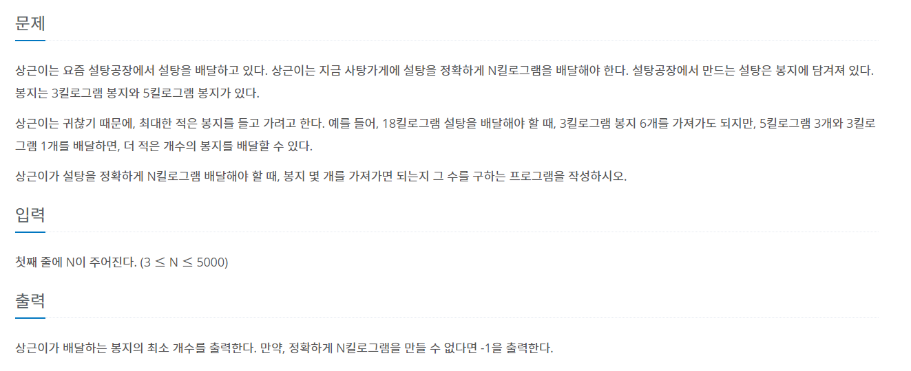

# 7월 22일

## 🚩 설탕 배달

#### ✍ 풀이

- 가장 최소 봉지를 구하는 것이므로 5키로부터 개수를 센다.
- `five`라는 들어온 `n`의 무게에서 최대로 포함할 수 있는 5키로의 개수를 담아둔다.
- `while`문에서 `5`키로 봉지를 빼고 나머지가 `0` 이라면 `while`문을 나온다.
-  나머지를 `3`으로 나누었을 때 나머지가 `0`이라면 `while`문을 나온다.

