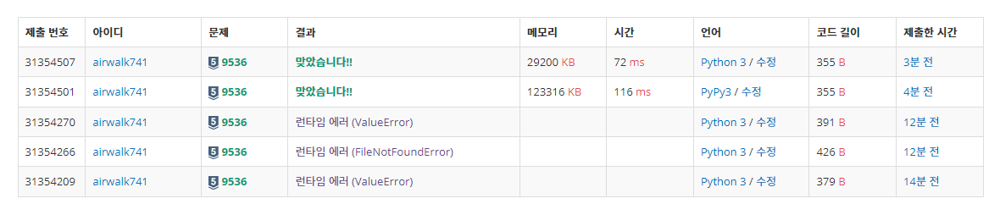
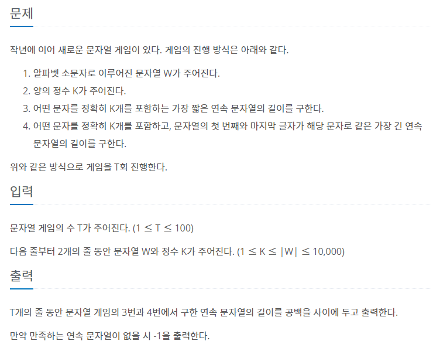
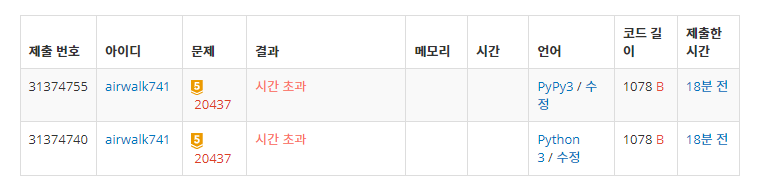

# 7월 23일

## 🚩 여우는 어떻게 울지?

#### ✍ 풀이

- 여우가 아닌 울음 소리들을 `sori` 라는 `dict`에 담아두기
- `sori`에 있지 않은 울음 소리면 출력하기

#### 😒 FAIL

- 다른 `testcase` 출력할 때 개행을 해주지 않았다.

## 🚩 문자열 게임 2

#### 😒 FAIL

- 완전 탐색으로 구하고자 했다.
- 하지만 문제를 잘 못 이해해서 코드가 엉망이였다.
- 그래도 시간 초과...
- 슬라이딩 윈도우를 어떻게 사용하는 것일까...

