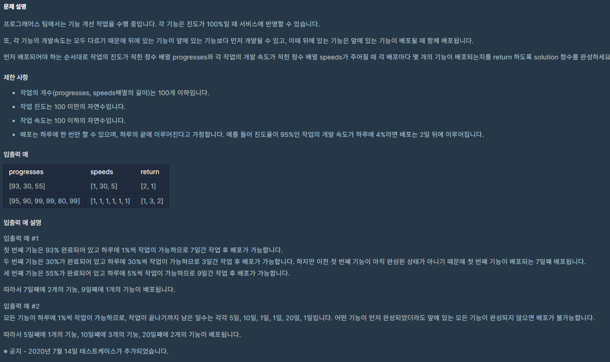

# 7월 26일

## 🚩 기능개발

[](https://programmers.co.kr/learn/courses/30/lessons/42586?language=python3)


#### ✍ 풀이

- `progresses` 변수에 작업을 완료할 수 있는 날짜를 다시 담아 둔다.
- `_max`를 설정해서 그것보다 크다면 배포하는 날을 다음 날로 바꿔준다.

```python
def solution(progresses, speeds):
    answer = []
    
    for i in range(len(progresses)):
        
        n = 100 - progresses[i] # 남은 일 %
        
        if n % speeds[i]: # 나머지가 있으면 하루 추가
            progresses[i] = n // speeds[i] + 1
        else:
            progresses[i] = n // speeds[i]
            
    _max = progresses[0] # 최댓값 설정
    cnt = 0
    
    
    for i in range(len(progresses)):
        
        if _max >= progresses[i]: # 최댓값보다 작으면 cnt 추가 (앞에 일이 끝나야 배포할 수 있음)
            cnt += 1
                
        else:
            answer.append(cnt)
            cnt = 1
            _max = progresses[i]
            
    answer.append(cnt)
    
    return answer
```


