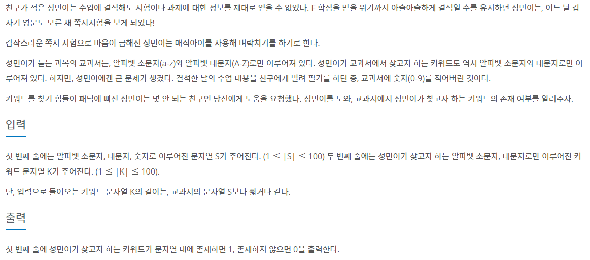

# 7월 29일

## 🚩 나는 친구가 적다 (Small)

[](https://www.acmicpc.net/problem/16171)


#### ✍ 풀이

- 함수 사용으로 해결
- `replace(현재 str, 새로운 str)`


#### 🎁 다른 사람 풀이

```python
l = input()
newl = ""

for c in l:
    if c in "0123456789":
        pass
    else:
        newl += c
findl = input()
if findl in newl:
    print(1)
else:
    print(0)
```

- `in` 사용으로 시간을 줄였다.
