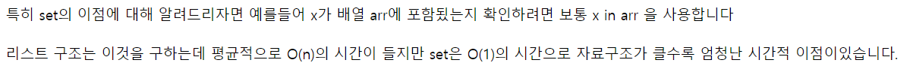

# 7월 6일

## 🚩 N과 M (9)

[](https://www.acmicpc.net/problem/15663)


#### ✍ 풀이

- 이전 것들과 똑같은 방식으로 풀었는데 중복인 것을 체크하기 위해 `set()`을 이용했다.
- 한번도 출력하지 않았다면 출력하고 `result`에 담아 중복을 체크해 두었다.


#### 😒 FAIL 이유

- 처음에는 `set()`이 아닌 리스트로 만들어서 사용했다.
- 구글링을 해보니 중복을 체크할 때는 리스트보다는 `set()`이 시간이 더 적게 걸림을 알았다.


[](https://tkql.tistory.com/37)


#### 🎁 다른 풀이

```python
# N과 M(9)

import sys
N, M = map(int, sys.stdin.readline().split())
arr = sorted(list(map(int, sys.stdin.readline().split())))
visited = [False] * N
out = []  # 출력 내용

def solve(depth, N, M):
    if depth == M:  # 탈출 조건
        print(' '.join(map(str, out))) # list를 str으로 합쳐 출력
        return
    over = 0
    for i in range(len(arr)):
        if not visited[i] and over != arr[i]:
            visited[i] = True
            over = arr[i]
            out.append(arr[i])  # 탐사 내용
            solve(depth + 1, N, M)
            out.pop()
            visited[i] = False

solve(0, N, M)
```


- `set()`을 이용하지 않고 `over`라는 변수를 만들어 중복으로 들어갈 경우를 배제시켜줬다.
- 예를 들어 `1, 1, 7, 7, 9` 에서 3개만 뽑는다고 하면
  - 117 이 뽑혔을 때 `over`가 이미 `7`이기 때문에 `3`의 `index`는 재귀로 돌리지 않는다.
- 백트레킹을 요구하는 문제인건 알았지만 이렇게 써야하는지는 몰랐다...


