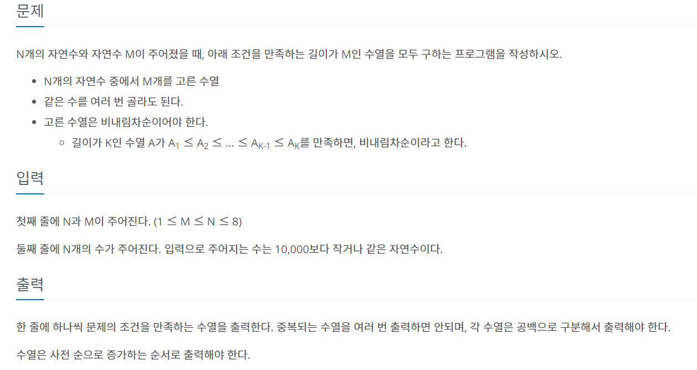

# 7월 7일

## 🚩 N과 M (10)

#### ✍ 풀이

- 시간 복잡도가 적은 `set()`을 이용해서 해결

## 🚩 N과 M (11)

#### ✍ 풀이

- 중복을 포함해도 되기 때문에 `N과 M (10)` 과는 달리 `idx`라는 인자가 없다.
- 그것 말고는 풀이는 똑같다.

## 🚩 N과 M (12)

#### ✍ 풀이

- 중복을 포함하기 때문에  `N과 M (10)` 풀이에서 `i + 1`을   `i`로 재귀를 돌리면 된다.
- 코딩테스트 봤을 때 순열도 자주 나오는 것 같길래 **N 과 M** 시리즈를 풀었는데 반복되는게 많아서 좀 실망이다...