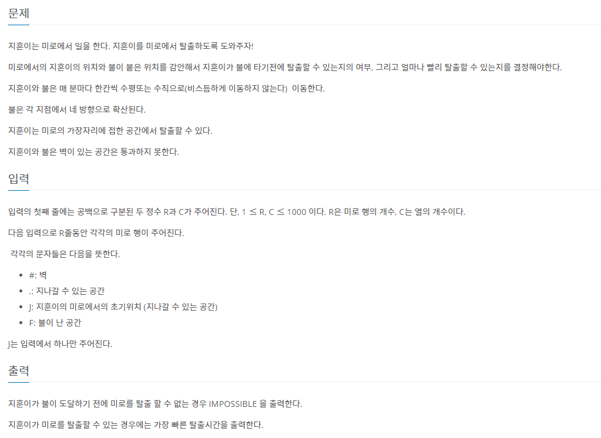

# 7월 8일

## 🚩 트리 순회

####  ✍ 풀이

- 트리의 기본 3가지 탐색이다.
- 정보처리기사 공부할 때 손으로 풀다가 코딩으로 하려니 신기했던 문제이다.
- 전위 순회 => 중 왼 오
- 중위 순회 => 왼 중 오
- 후위 순회 => 왼 오 중

## 🚩 불!

#### ✍ 풀이

- 지훈이가 이동하고 불이 이동했다.
- 이유는 불이 이동한 곳이 지훈이의 위치이면 안되기 때문이다.
- 따라서 지훈이 배열에 있는 위치 먼저 4방향 탐색을 한 후 불이 있는 위치들을 4방향 탐색을 했다.

#### 😒 FAIL 이유

- 벽이 있다는 사실을 고려하지 않았다.

